# 面向多租户流式语音转录服务的纠错收益感知并发推理方法研究

> 文档版本：v1.3（双 RTX 3090 资源约束版）  
> 更新日期：2026-09-03  
> 实现基线：Qwen3-ASR-1.7B、在线/离线双输入、上下文记忆池、AgenticASR 滑动窗口 Refiner  
> 硬件边界：同一主机内 2×RTX 3090，每张 24GB 独立显存；训练与在线服务分时运行  
> 研究主线：纠错收益预测、质量—时延—公平联合调度、可信记忆更新

## 1. 项目概述

### 1.1 推荐题目

**面向多租户流式语音转录服务的纠错收益感知并发推理方法研究**

备选题目：

- 面向多租户流式 ASR 的低开销选择性上下文纠错与 SLO 调度研究
- 基于上下文记忆池的多租户流式语音转录质量—时延协同优化方法研究

### 1.2 核心问题

在服务器资源有限、多个用户同时提交实时语音流和离线长音频的情况下，不同语音片段的识别难度和纠错价值并不相同。如果所有片段都同步执行“ASR—上下文检索—大模型纠错”，会明显增加转录延迟并降低系统并发能力；如果完全不执行上下文纠错，又容易在专有名词、自我修正、中英混说和长会话一致性方面产生错误。

本项目研究以下核心问题：

> 如何预测不同语音片段的纠错收益，并在转写质量、服务时延、资源成本、上下文状态和多租户公平性之间进行联合决策？

### 1.3 研究目标

1. ASR 初稿能够快速返回，不被上下文检索和 Refiner 阻塞。
2. 仅对高风险、高收益片段执行上下文纠错。
3. 支持口语清理、自我修正、专有名词纠错和局部回改。
4. 多租户并发时保证实时请求的时延，同时防止长请求饥饿。
5. 保证不同用户的记忆池、实体和推理状态严格隔离。
6. 建立覆盖识别质量、AgenticSR 能力、流式稳定性、系统性能和公平性的综合评测体系。
7. 同时支持在线流式输入与离线长音频输入，并隔离两类负载的排队、批处理和 GPU 资源。
8. 防止错误转录或错误纠错被反复回写后形成“错误记忆自强化”。
9. 在双 RTX 3090 条件下完成 1、2、4、6、8 路在线并发实测；16、32 路只作为过载、排队或校准仿真实验，不承诺全部满足低延迟 SLO。

### 1.4 预期贡献

1. 基于 ASR、声学、实体和上下文记忆特征的纠错收益预测方法。
2. 面向多租户流式 ASR 的质量—时延—公平联合调度方法。
3. 面向上下文记忆池和流式回改窗口的状态分级管理机制。
4. 包含 AgenticSR 质量、流式稳定性和 Quality Goodput 的综合评测体系。
5. 面向在线流式与离线长音频混合负载的双资源池固定分卡与 batch 边界协同调度机制。
6. 基于来源可信度、证据链、TTL 和冲突隔离的可信记忆闭环。

---

## 2. 研究边界与现有工作的关系

### 2.1 上下文记忆池专利

既有专利《一种基于上下文记忆池的语音转录纠错方法》提供了本项目的单会话纠错技术基线，包括：

- 对音频进行采样率、声道、编码和分段预处理；
- 保存历史文本、语义向量、时间戳、置信度、专有名词与纠错状态，并通过唯一标识符关联；
- 根据低置信度、实体冲突和上下文不一致触发纠错；
- 按时间邻近、语义相似和专有名词关联检索纠错证据；
- 生成多个候选，并根据语义一致性和约束满足度排序；
- 通过淘汰、合并、降权维护有限容量记忆池；
- 将最终结果及纠错状态回写记忆池，形成闭环。

因此，本项目不把“构建上下文记忆池、检索上下文并生成纠错候选”作为新的核心创新，而是将其作为基础模块。项目重点研究既有方案尚未解决的在线增量稳定、多用户隔离、错误记忆传播、选择性纠错和混合负载调度问题。

专利中的部分实现细节需要工程化修正：

- “语义相似度低”更可能表示话题切换，不能单独作为错误证据；应优先判断“语义相关但关键实体不一致”。
- 自动纠错结果不能直接无条件提升为高可信记忆；必须结合来源、证据、重复验证或用户确认。
- 面向 ASR 错误的检索不能只有语义向量，还应加入拼音、音素、别名和编辑距离。
- 实时路径不宜使用高温度、多候选、长输出的自由生成，应使用包含 `KEEP` 的约束候选和局部 Patch。

### 2.2 AgenticASR

AgenticASR 将任务从逐字转录扩展为在线口语转书面文本，允许系统利用后续语音证据修改最近已经输出的内容，适合处理：

- 填充词和口吃；
- 无意义重复；
- 单次或多次自我修正；
- 拼写和实体解释；
- 数字、日期和金额格式化；
- 最终意图恢复。

论文采用 ASR—Refiner 两阶段架构。在线模式中，Chunk Manager 根据 VAD 和句末标点确定源文本边界，每个源片段最长 $L=80$ 字符；在时刻 $t$，拼接当前源片段和最多 $K-1$ 个历史源片段，Refiner 输出该窗口对应的一段干净文本，再替换此前窗口对应的输出。论文默认 $K=3$，窗口外文本保持不变。

论文中值得作为复现基线的结果包括：

- 训练集包含 100,000 个 ASR 风格文本—干净文本对，其中 20% 执行截断和识别错误模拟，以训练模型不补写尚未观察到的内容；
- 训练数据包含无修正、单次修正、回滚修正和多次修正，并保留 pass-through 样本；
- 固定 Qwen3-ASR-1.7B 前端时，0.5B、1B、4B Refiner 的 Overall 分别为 78.76、79.95、83.42；更大的模型主要改善 Format 和 Rephrase，但延迟更高；
- 在线窗口从 $K=1$ 增加到 $K=3$ 时，Rephrase 从 36.17 提升到 70.47，Explanation 从 19.43 提升到 74.00，接近离线结果 72.83 和 75.20。

本项目复现其“有界源窗口 → 干净窗口文本 → 局部替换”机制，但不直接照搬整窗覆盖实现。为适配多用户实时服务，引入选择性调用、动态窗口、上下文记忆、确定性 Patch 编译、版本校验和 SLO 感知调度。

### 2.3 本项目的差异化定位

```text
上下文记忆池：提供单会话历史信息与纠错证据
             ↓
AgenticSR：提供口语清理、最终意图恢复和局部回改
             ↓
本项目：决定哪些用户、哪些片段、在何时、以多大成本执行纠错
```

### 2.4 技术继承与新增研究边界

| 技术内容 | 来源定位 | 本项目处理方式 |
|---|---|---|
| 文本、向量、时间戳、置信度、专名联合存储 | 既有专利基线 | 保留并扩展来源、版本、TTL、证据链和冲突状态 |
| 低置信/实体冲突触发纠错 | 既有专利基线 | 扩展为可学习的纠错收益与负向编辑风险预测 |
| 时间、语义、专名联合检索 | 既有专利基线 | 加入拼音/音素召回、租户硬过滤和分级检索 |
| 候选生成与加权排序 | 既有专利基线 | 保留原文候选；Refiner 输出干净窗口，由确定性 Diff 编译 Patch |
| 纠错结果回写 | 既有专利基线 | 增加可信写回门、隔离区和错误传播控制 |
| 有界窗口口语转书面 | AgenticASR 基线 | 复现 $L=80$、$K=1/2/3$ 与整窗干净文本输出 |
| 在线流式局部回改 | AgenticASR + 本项目扩展 | Stable Prefix、Mutable Tail、确定性 Diff、版本化 Patch |
| 在线/离线混合并发 | 本项目重点 | 分资源池、收益感知调度、长请求防饥饿 |
| 多租户状态与公平 | 本项目重点 | 命名空间隔离、服务债务、公平性评测 |

---

## 3. 系统总体架构

```mermaid
flowchart LR
    RT[在线 WebSocket/gRPC] --> GW[API Gateway\n租户/会话/限流]
    OF[离线文件/对象存储] --> GW
    GW --> PRE[解码/16kHz 单声道/VAD]

    PRE -->|实时音频帧| RQ[Realtime Scheduler]
    PRE -->|离线任务| OQ[Offline Queue]

    RQ -->|会话粘性路由| RG[Realtime GPU Pool\nQwen3-ASR Streaming Workers]
    OQ --> BK[时长分桶/动态 Batch]
    BK --> OG[Offline GPU Pool\nQwen3-ASR Batch Workers]

    RG --> AGG[Transcript Aggregator]
    OG --> AGG
    AGG --> FAST[立即返回 ASR 初稿]
    AGG --> MW[暂定记忆写入]

    MW --> RISK[纠错风险/收益预测]
    MEM[(可信上下文记忆池)] --> RET[混合检索\n时间/实体/拼音/语义]
    RISK -->|需要纠错| RET
    RISK -->|无需纠错| COMMIT[稳定提交]
    RET --> REF[Text-to-Text Refiner\n输出干净窗口文本]
    REF --> DIFF[Deterministic Diff\nPatch Compiler]
    DIFF --> PATCH[Patch 校验与版本控制]
    PATCH --> COMMIT
    COMMIT --> OUT[partial/revised/final]
    COMMIT -->|通过可信写回门| MEM

    MET[Metrics/Trace/Audit] -.-> RQ
    MET -.-> OQ
    MET -.-> REF
```



系统采用“初稿—终稿分离”设计：

- 在线 ASR 位于同步快速路径，按会话粘性路由到单个常驻 streaming worker；
- 离线 ASR 位于异步队列，按有效语音时长分桶并动态 batch；
- 在线与离线使用独立队列并固定分配 GPU；动态资源借用仅作为扩展实验；
- 初始转录完成后立即返回用户；
- 风险评估、上下文检索和 Refiner 位于异步路径；
- Refiner 只重写有界 Mutable Tail，Patch Compiler 将新旧窗口做确定性 Diff，禁止模型自行计算字符偏移；
- Realtime、Offline 和 Refiner 分别使用独立调度器，由 Admission Controller 统一控制总负载和租户配额；
- 在线路径只发送可重放的原始 ASR 假设，纠错路径通过版本化窗口替换异步更新结果。

需要特别注意：按当前 Qwen3-ASR 官方实现，流式推理仅支持 vLLM 后端，且不支持 batch inference、ForcedAligner 和时间戳返回；Transformers/vLLM 的离线接口支持 batch，时间戳通过单独的 Qwen3-ForcedAligner-0.6B 获取。因此在线并发依靠单进程有界活跃会话、会话轮询和背压，不在单卡上复制多个完整模型实例。动态 batch 只用于离线 ASR 和可批处理的 Refiner；精确词/字级时间戳只在离线终稿阶段生成。

### 3.1 双 RTX 3090 固定拓扑

两张 3090 各自只有 24GB 显存，不能把总计 48GB 当作单个统一显存池。Qwen3-ASR-1.7B 规模较小，不采用跨卡 Tensor Parallel；跨卡通信会增加复杂度，却不能解决本项目真正的在线/离线资源隔离问题。

MVP 采用静态分卡：

| GPU | 常驻服务 | 优先目标 | 不承担的工作 |
|---|---|---|---|
| GPU 0 | Qwen3-ASR-1.7B vLLM Streaming（单实例） | 在线 ASR 首次结果与尾延迟 | 离线长音频、Refiner、训练 |
| GPU 1 | GPU1 Arbiter：Qwen3-ASR-1.7B Offline 与 0.5B～1B Refiner | 离线吞吐与异步纠错 | 默认不承担在线 ASR 会话 |

GPU 1 不把两个 vLLM 实例的显存比例简单相加。由 GPU1 Arbiter 串行或按受控微批运行离线 ASR 与 Refiner：Refiner 到达后不再接收新的离线 batch，当前 batch 在边界结束后切换；单个 batch 必须有最大执行时间。若共卡 profile 不稳定，第一版将 Refiner 改为量化 Transformers/CPU 路径，而不是继续压缩显存比例。

### 3.2 初始显存预算

以下是启动压测用的工程起点，不是最终配置：

| 服务 | 建议起始 `gpu_memory_utilization` | 说明 |
|---|---:|---|
| GPU 0 在线 Qwen3-ASR | 0.75～0.80 | 独占卡，保留驱动、临时张量和突发余量 |
| GPU 1 离线 Qwen3-ASR | 由 profile 决定，初始不超过 0.50 | 控制 batch 总音频秒数、输出长度和峰值显存 |
| GPU 1 小型 Refiner | 由 profile 决定，初始不超过 0.25 | 量化权重、KV/激活与最大输出长度单独测量 |
| GPU 1 安全余量 | 实测保留，目标不少于 3 GiB | 不是可被其他实例使用的显存配额 |

vLLM 的 `gpu_memory_utilization` 是实例级限制，不能据此推断多进程的总显存上限。实际启动顺序、空闲显存、CUDA 临时张量和碎片都会影响结果，必须以 `nvidia-smi`、引擎 profile、峰值显存和长输入压力测试共同校准。

### 3.3 运行模式

```text
服务模式：GPU0 在线 ASR；GPU1 离线 ASR + 小 Refiner
训练模式：停止在线/离线服务，两张 GPU 用于 LoRA/QLoRA 或实验
评测模式：按实验配置独占 GPU，避免服务负载污染结果
```

不允许训练任务与在线服务同时运行。第一版不实现模型热迁移或频繁装载/卸载，动态 GPU 借用降为扩展实验。

### 3.4 软件与主机要求

- 优先使用原生 Linux 部署；vLLM 不原生支持 Windows，WSL 仅作为开发备选。
- 两张 3090 需要稳定散热、足够电源和匹配的 NVIDIA 驱动/CUDA 环境。
- CPU 负责音频解码、重采样、VAD、拼音/编辑距离、Embedding 检索和 API 服务。
- 模型权重、容器、驱动、CUDA、PyTorch、qwen-asr 和 vLLM 版本写入可复现环境清单。
- Qwen3-ASR 与替代后端（Fun-ASR、FunASR runtime、sherpa-onnx）使用独立虚拟环境或容器；以仓库 commit、锁定文件和镜像摘要记录版本，不在同一环境混装不同 vLLM 依赖。当前 GitHub 快照中 `qwen-asr`、Fun-ASR 与 FunASR runtime 的 vLLM 依赖可能不同，升级任一栈都必须重新做兼容性和容量测试。

### 3.5 `dual_3090.yaml` 初始配置草案

```yaml
hardware:
  topology: static_dual_gpu
  training_exclusive: true

gpu0_realtime_asr:
  device: cuda:0
  model: Qwen/Qwen3-ASR-1.7B
  gpu_memory_utilization: 0.78
  streaming_batch: false
  concurrency_probe: [1, 2, 4, 6, 8]

gpu1_offline_asr:
  device: cuda:1
  model: Qwen/Qwen3-ASR-1.7B
  gpu_memory_utilization: 0.50
  batch_policy: duration_and_memory_bounded

gpu1_refiner:
  device: cuda:1
  model_tier: 0.5B_to_1B
  execution: gpu1_arbiter
  memory_budget_gib: profile_required
  priority_over_new_offline_batch: true
  max_batch_wait_ms: 100
  max_window_chunks: 3
  max_window_chars: 240

headroom:
  gpu1_min_free_gib: 3
```

配置中的比例和阈值必须通过显存 profile 修订。GPU1 的 `execution: gpu1_arbiter` 表示服务由一个仲裁器控制任务边界，不代表两个实例可以安全地同时占满显存。若共卡无法稳定运行，优先降低离线 batch/KV 缓存和 Refiner 最大输出；仍不稳定时改为 GPU1 分时加载或将 Refiner 放到 CPU，而不是侵占 GPU0 在线卡。

### 3.6 GitHub 实现核对与推荐选型

已核对以下公开实现：

| 实现 | 已验证能力 | 在本项目中的定位 |
|---|---|---|
| [Qwen3-ASR 官方仓库](https://github.com/QwenLM/Qwen3-ASR) | vLLM 流式 state；流式不支持 batch、时间戳和 ForcedAligner；离线接口支持 batch，时间戳由 `Qwen3-ForcedAligner-0.6B` 提供 | 论文主模型和质量路径 |
| [AgenticASR system](https://github.com/AnXMuy/AgenticASR/tree/main/system) | `sherpa-onnx` 在线 ASR、累计假设 ChunkManager、默认 `K=3` Refiner；当前 Refiner 后端为 MLX | 复用窗口和回改算法，不直接作为 Qwen3-ASR 服务实现 |
| [FunASR runtime WebSocket](https://github.com/modelscope/FunASR/tree/main/runtime/python/websocket) | online/offline/2pass、VAD、标点、热词、多客户端非阻塞推理，并可按阶段设置并发信号量 | Paraformer 等非 LLM 流式工程对照 |
| [Fun-ASR 官方仓库](https://github.com/QwenAudio/Fun-ASR) | 800M 中文/多语种 LLM-ASR；vLLM batch、`FunASRNanoStreamingVLLM` 和 WebSocket 服务 | 同类 LLM-ASR 流式备选；Qwen3-ASR 不满足容量时的优先替代 |
| [sherpa-onnx](https://github.com/k2-fsa/sherpa-onnx) | 多种 ONNX 流式 ASR、VAD 和跨平台部署；可由异步 WebSocket 服务包装 | CPU/轻量实时前端对照，不作为 Qwen3-ASR 质量结论 |

### 3.7 替代模型调研与角色边界

截至 2026-09，GitHub 上值得纳入本项目候选池的模型可按“论文主线、同类 LLM-ASR、低延迟工程、离线质量/多语种扩展”四种角色组织。下面的“原生流式”只表示官方仓库提供了增量/流式接口，不等于已经在本项目的双 RTX 3090、16 kHz PCM 和多租户负载下达到目标 SLO；最终结论必须以第 16.0 节的同机实测为准。

| 模型/实现 | 规模与语言 | 原生流式/部署能力 | 本项目建议角色 | 主要限制 |
|---|---|---|---|---|
| **Qwen3-ASR-1.7B / 0.6B** | 中文、英文、日文；0.6B/1.7B | 官方 vLLM streaming state；离线支持 batch；时间戳由独立 ForcedAligner 提供 | 论文主线、容量消融与 GPU0 备选 | 官方流式不支持 batch、时间戳和 ForcedAligner；必须固定 vLLM API 和状态语义 |
| **Fun-ASR-Nano-2512** | 800M；中文、英文、日文及中文方言/口音 | FunASR 官方仓库已提供 vLLM batch、`FunASRNanoStreamingVLLM` 和 WebSocket 服务；示例默认 `chunk_ms=720` | 最优先的中文工程流式备选；也可作为 Qwen3-ASR 的同类 LLM-ASR 对照 | 不应直接沿用 Qwen3-ASR 的流式状态假设；具体时间戳、首字延迟和显存须实测 |
| **Fun-ASR-MLT-Nano-2512** | 800M；31 语言 | 与 Fun-ASR-Nano 共用 FunASR/vLLM 部署路径 | 多语种扩展实验 | 中文质量和流式性能不能由 Nano-2512 结果代替，需单独评估 |
| **Paraformer-zh-streaming / FunASR 2-pass** | 约 220M；中文/英文 | FunASR runtime 提供 online/offline/2-pass WebSocket、VAD、标点和热词 | 最成熟的低延迟中文工程基线 | 不是 LLM-ASR；与 Qwen3-ASR 的质量差异必须单独报告 |
| **sherpa-onnx Zipformer / SenseVoice / Paraformer** | 轻量 ONNX；中文、英文及多语种变体 | 在线状态、C++/Python/WebSocket、CPU/边缘设备部署 | CPU/高并发轻量基线；复现 AgenticASR 前端 | 适合吞吐和延迟对照，不作为上下文纠错质量主结论 |
| **FireRedASR2-AED / FireRedASR2-LLM** | 中文普通话、20+ 方言/口音、英文和中英混说；参数规模以具体模型卡为准 | 官方提供 batch 推理；AED 支持词级时间戳和置信度；FireRedVAD 支持流式 VAD；仓库另有 vLLM 适配说明 | 中文/方言离线质量上限基线；可作为 Qwen3-ASR 的强质量对照 | 当前公开接口不能直接视为已验证 ASR streaming state；不纳入默认在线链路 |
| **GLM-ASR-Nano-2512** | 约 1.5B；17 语言，强调中文、方言和低音量语音 | 官方 Transformers/SGLang 推理 | 困难音频离线质量对照 | 未确认有与 Qwen3-ASR 等价的官方流式 state；SGLang 路径仍有开发版依赖 |
| **faster-whisper / whisper.cpp** | Whisper 多语种；`large-v3`/`turbo` 等 | GPU FP16/INT8、batch、VAD、词级时间戳；流式由 Whisper-Streaming/WhisperLive 等封装 | 离线多语种和时间戳基线 | 原生模型不是增量流式；重复窗口推理会增加延迟和显存 |
| **WeNet Conformer/Paraformer** | 中文及多语种模型 | 生产导向的 streaming/non-streaming runtime，支持 GPU/ONNX/TensorRT 路径 | 学术上可解释的流式工具链对照 | 集成和环境工作量高于 FunASR/sherpa-onnx，不建议作为第一条工程备选 |
| **NVIDIA Nemotron-3.5-ASR-Streaming-0.6B** | 约 0.6B；官方称支持 40 语言 | Cache-aware FastConformer，延迟可调约 80 ms～1 s；NeMo 部署 | 多语种低延迟工程扩展 | 纳入中文实验前必须核对模型卡语言列表和 RTX 3090 兼容性；不作为默认中文主线 |
| **Omnilingual ASR** | 300M/1B/3B/7B；1600+ 语言，含普通话 | 官方 fairseq2 pipeline，支持 batch；当前 README 仍提示单段小于 40 秒 | 极端多语种研究扩展 | 不是本项目中文实时服务的直接候选；7B 显存和部署复杂度高 |
| **Moonshine** | 英语实时模型及小型端侧模型 | 从头训练的 streaming 模型，支持低延迟和微型设备 | 端侧/超低资源方法学参考 | 中文主线支持不足，不纳入本项目中文服务候选 |

推荐的决策顺序是：保留 Qwen3-ASR-1.7B 作为论文主线；优先实测 Fun-ASR-Nano-2512 作为同类 LLM-ASR 流式备选；若首字延迟和并发优先于模型能力，则选择 Paraformer-zh-streaming + 2-pass；若 CPU/轻量高并发优先，则选择 sherpa-onnx Zipformer。Nemotron 只有在确认中文支持后才进入多语种扩展。FireRedASR2 和 GLM-ASR 只承担离线质量/困难音频对照，不能与在线后端混成一个结论。

不建议同时建设多个生产链路。第 16.0 节最多选择一个完整替代后端，其他模型只做统一数据集上的冒烟或离线基线。

因此保留两条明确结果线：

1. **研究主线**：Qwen3-ASR 官方 streaming state → ChunkManager → 小型 Text Refiner，用于研究纠错收益和调度；
2. **工程对照线**：Fun-ASR-Nano 原生流式、FunASR 2-pass 或 sherpa-onnx 在线前端三者择一 → 异步终稿，用于验证更高并发和更低首字延迟。

两条结果线必须分别报告模型、时间戳能力、延迟和质量，不能把替代后端的在线结果与 Qwen3-ASR 的离线质量直接合并为一个模型结论。若第 4 月容量测试表明 Qwen3-ASR 单卡流式无法达到目标并发，工程 MVP 采用已验证的替代后端，论文仍保留 Qwen3-ASR 作为质量主线和对照实验。

---

## 4. API 与多租户会话管理模块

### 4.1 接口设计

实时语音建议采用 WebSocket，离线音频采用 HTTP：

```text
POST   /sessions
WS     /sessions/{session_id}/stream
GET    /sessions/{session_id}/result
POST   /sessions/{session_id}/entities
DELETE /sessions/{session_id}
POST   /offline/jobs
GET    /offline/jobs/{job_id}
POST   /offline/jobs/{job_id}/cancel
POST   /memories/entities
PATCH  /memories/{memory_id}
DELETE /memories/{memory_id}
```

离线接口立即返回 `job_id`，不在 HTTP 请求内同步等待长音频完成。所有写接口支持 `idempotency_key`；离线任务状态至少包括 `queued/running/refining/aligning/succeeded/failed/cancelled`。可选 webhook 使用签名校验并按至少一次语义投递。

创建会话请求示例：

```json
{
  "tenant_id": "tenant_001",
  "mode": "realtime",
  "language": "zh",
  "quality_level": "balanced"
}
```

`first_result_slo_ms` 和 `final_result_slo_ms` 不由客户端直接设定。服务端根据租户套餐、模型档位和当前容量生成受限 deadline；客户端只能选择 `quality_level` 或声明一个不低于服务端下限的期望值。服务端还必须限制单租户并发会话数、单段音频时长、输入缓冲区和离线任务积压。

音频帧元数据示例：

```json
{
  "session_id": "session_001",
  "sequence_id": 12,
  "sample_rate": 16000,
  "timestamp_ms": 1480,
  "is_final": false
}
```

### 4.2 会话状态

```python
class SessionState:
    tenant_id: str
    session_id: str
    language: str
    quality_level: str
    audio_buffer: object
    asr_stream_state: object
    active_revision_window: object
    committed_text: str
    tentative_text: str
    memory_pool_id: str
    first_result_deadline: float
    final_result_deadline: float
    last_active_time: float
    state_level: str  # hot / warm / cold
    transcript_version: int
    input_seq_no: int
    mutable_tail_start: int
    overload_level: int
```

所有数据访问必须同时校验 `tenant_id` 和 `session_id`。缓存键、向量检索过滤条件、日志索引和持久化主键都必须包含租户信息。

流式事件统一采用会话级单调递增版本。第一版使用“整窗口替换 + CAS”协议，避免客户端和不同语言运行时对中文字符偏移的解释不一致：

```json
{
  "event": "partial | replace_window | final",
  "session_id": "session_001",
  "window_id": "win_012",
  "base_version": 17,
  "result_version": 18,
  "base_hash": "sha256-of-current-window",
  "is_final": false,
  "text": "地点在四号楼，即研发中心所在楼栋。"
}
```

服务端按会话串行提交或使用原子 CAS；客户端只应用 `base_version` 和 `base_hash` 均一致的事件。重复事件按 `session_id + result_version` 幂等忽略，缺失版本时请求当前快照。内部可以使用 Diff 优化传输，但不能依赖客户端解释 `start_char/end_char`。

---

## 5. VAD 与流式音频切块模块

### 5.1 输入规范

- 采样率：16 kHz；
- 声道：单声道；
- 格式：PCM16；
- 客户端音频帧：20～40 ms；
- 服务端 ASR chunk：约 0.8～2 秒；
- 第一版使用 Qwen3-ASR 官方 streaming state 管理上下文，不额外重叠原始音频；只有在替代 ASR 后端时才启用重叠，并实现明确的时间范围去重。

Qwen3-ASR 复现基线先固定官方示例参数：`chunk_size_sec=2.0`、`unfixed_chunk_num=2`、`unfixed_token_num=5`，客户端送入 0.5/1/2/4 秒步长做敏感性实验；完成基线后再调整服务端 chunk，不把不同参数的结果混在同一容量结论中。

音频 chunk 与 Refiner 源文本片段不是同一个概念。ASR 可以持续产生 partial，只有满足以下任一条件时，Boundary Manager 才关闭一个 Refiner 源片段：

- VAD 检测到稳定语音边界；
- 出现可靠句末标点；
- 源文本达到 $L=80$ 字符，并优先回退到最近标点处截断；
- 会话结束或 Mutable Tail 达到安全上限。

$L=80$ 作为 AgenticASR 复现基线，后续通过 $L\in\{40,80,120\}$ 消融确定目标领域的最佳值。Refiner 不响应每一次 token 级 partial，只响应稳定源片段、明确修正事件或终稿刷新事件。

### 5.2 任务结构

```python
class AudioChunkTask:
    tenant_id: str
    session_id: str
    chunk_id: int
    audio: bytes
    speech_duration: float
    arrival_time: float
    deadline: float
    priority_class: str
    is_endpoint: bool
```

### 5.3 有效语音时长

调度器使用 VAD 后的有效语音时长，而不是文件总时长估计计算成本。这样可避免长静音音频被误判为高成本请求。

在线与离线采用不同切块策略：

- 在线路径优先低延迟，使用连续流状态和 VAD 端点，不为了凑 batch 延迟实时任务；Qwen3-ASR 的 `state.text` 作为累计假设交给 ChunkManager；
- 离线路径优先吞吐，按有效语音时长分桶；超长文件切段时若保留重叠，必须在拼接阶段依据时间或词序列去重；
- 音频解码、重采样、VAD 和格式校验放在 CPU 预处理层，避免占用 GPU worker；
- 为单会话设置有界环形缓冲区，积压超过阈值时触发背压或过载降级，禁止无限缓存音频。

---

## 6. 流式 ASR 推理模块

### 6.1 模型选择

主实验建议：

- 主模型：Qwen3-ASR-1.7B；
- 轻量消融/容量对照：Qwen3-ASR-0.6B；
- 首选工程流式备选：Fun-ASR-Nano-2512；
- 低延迟中文基线：Paraformer-zh-streaming + FunASR 2-pass；
- CPU/边缘基线：sherpa-onnx Zipformer；
- 离线质量对照：FireRedASR2-AED/LLM、GLM-ASR-Nano-2512、faster-whisper；
- 多语种扩展：Fun-ASR-MLT-Nano-2512；若模型卡确认中文支持，再追加 Nemotron-3.5-ASR-Streaming-0.6B；Omnilingual ASR 只做离线扩展实验。

本项目不从头训练 ASR，主要研究推理服务和选择性纠错。

工程环境必须固定模型权重、`qwen-asr`、vLLM、CUDA 和容器镜像版本。当前官方仓库的包版本和 vLLM 依赖以仓库 `pyproject.toml` 为准，不能只写“最新版”。升级依赖前重新执行准确率、峰值显存、TTFP、RTF 和并发回归测试。

ASR 后端必须通过统一适配器接入，至少提供以下接口：

```python
class StreamingASRBackend(Protocol):
    def start(self, *, sample_rate: int, language: str | None) -> object: ...
    def push(self, state: object, pcm16: bytes) -> str: ...
    def finish(self, state: object) -> str: ...
    def reset(self, state: object) -> None: ...
```

Qwen3-ASR 适配器内部调用官方 `init_streaming_state`、`streaming_transcribe` 和 `finish_streaming_transcribe`。API 层接收的 PCM16 bytes 必须先转换为 16 kHz、单声道、`float32` 波形数组再传给 Qwen3-ASR；不能把原始 bytes 直接作为 streaming 输入。Fun-ASR、FunASR runtime 和 sherpa-onnx 适配器只作为对照实现，各自遵循其官方音频格式、chunk 和 state 生命周期。上层 ChunkManager、Refiner、调度器和评测器不得依赖具体 ASR SDK 的状态字段。

双 3090 条件下的模型策略：

- Qwen3-ASR-1.7B 在 GPU0 运行官方 vLLM streaming，在 GPU1 运行离线 batch；两者为独立实例，不做 Tensor Parallel；
- 若 GPU0 的 1.7B 在目标并发下无法满足 TTFP 或 RTF，使用 Qwen3-ASR-0.6B 作为实时容量备选，1.7B 保留在离线质量路径；两种模型的容量和质量结果必须分开报告；
- 在线卡只运行流式 ASR，避免 Refiner 或离线 batch 干扰首字延迟；
- GPU 1 常驻 Refiner 限制在 0.5B～1B；
- 4B Refiner 仅用于离线消融、生成偏好数据或 Teacher，不作为默认常驻服务；
- ForcedAligner 只在离线终稿阶段通过 GPU1 Arbiter 分时执行，不与高负载离线 ASR、Refiner 同时占用 GPU1；
- BF16/FP16、FlashAttention 和编译优化必须逐项验证，不能因为模型能够加载就认为并发达标。

### 6.2 统一输出结构

```json
{
  "chunk_id": 12,
  "text": "明天下午三点开会",
  "tokens": null,
  "sequence_confidence": null,
  "confidence_source": "token_logprob | proxy | calibrated",
  "timestamps_source": "none | frame_vad | forced_aligner",
  "language": "zh",
  "is_partial": true
}
```

### 6.3 置信度计算

序列级置信度可采用平均对数概率：

$$
C = \exp\left(\frac{1}{T}\sum_{t=1}^{T}\log p(y_t\mid y_{<t},x)\right)
$$

流式 Qwen3-ASR 当前不返回 token 时间戳，也不保证暴露 token 条件概率；因此上述字段必须允许为空。若模型无法提供可靠 token 概率，可增加以下代理特征：

- 解码分数；
- N-best 候选分数差；
- 语音—文本对齐分数；
- 重复率；
- 无语音概率；
- 文本压缩率。

由于具体推理后端未必稳定暴露 token 条件概率，系统不能把平均对数概率作为唯一触发条件。建议构造复合风险分数并在验证集上校准：

$$
C_{cal}=Calibrate(C_{decode},A_{align},M_{nbest},R_{repeat},P_{nospeech},E_{conflict})
$$

其中 `Calibrate` 可采用逻辑回归、Isotonic Regression 或轻量树模型；最终同时保存原始分数、代理特征和校准分数，便于回溯。时间戳只在离线终稿调用 ForcedAligner 后填充；在线阶段使用帧序号和 VAD 边界的近似时间。

### 6.4 初稿快速返回

```json
{
  "event": "partial_transcript",
  "version": 1,
  "segment_id": "seg_012",
  "text": "明天下午三点开会",
  "status": "tentative"
}
```

初稿返回不等待 NER、语义向量检索和 Refiner，保证首次可见文本延迟。

---

## 7. 上下文记忆池模块

### 7.1 数据结构

```python
class MemoryEntry:
    tenant_id: str
    user_id: str | None
    session_id: str | None
    entry_id: str
    segment_id: str

    raw_text: str
    final_text: str
    canonical_text: str
    aliases: list[str]
    phonetic_keys: list[str]
    embedding: list[float]
    entities: list[dict]

    asr_confidence: float
    correction_confidence: float
    start_time: float
    end_time: float

    source_type: str       # admin / user / asr / refiner / external_kb
    source_trust: float
    status: str            # tentative / confirmed / quarantined / superseded / rejected
    correction_type: str
    evidence_ids: list[str]
    parent_entry_id: str | None
    conflict_group_id: str | None
    validation_count: int
    retrieval_count: int
    version: int
    created_at: float
    last_accessed_at: float
    expires_at: float | None
```

记忆按作用域分为四层：

| 层级 | 内容 | 默认生命周期 | 主要来源 |
|---|---|---|---|
| 租户/项目记忆 | 产品名、行业术语、组织和业务规则 | 长期 | 管理员、审核知识库 |
| 用户记忆 | 常用人名、联系人、个人表达 | 周/月 | 用户确认、历史高可信结果 |
| 会话记忆 | 本次会议实体、主题和已确认片段 | 会话 + 短 TTL | 当前会话 |
| 活动窗口 | 最近音频对应的初稿和候选 | 秒级 | ASR/Refiner 暂定结果 |

长期、用户和会话记忆使用逻辑分区，活动窗口使用有界内存结构。租户/项目级条目的 `session_id` 允许为空，并通过 `scope` 和 ACL 字段表达可见范围。不同作用域的条目即使文本相同也不合并主键，只在检索排序时聚合证据。

### 7.2 暂定与确认机制

- ASR 初稿首先写入 `tentative`；
- 高置信且无冲突的结果可自动转为 `confirmed`；
- Refiner 结果通过 Patch 校验后仍为 `tentative` 或 `quarantined`，只有满足重复验证、可靠证据或用户确认后才转为 `confirmed`；
- 用户手动提供或修正的实体具有最高可信度；
- 被后续语音推翻的条目标记为 `rejected`；
- 被新版本替代但需要保留审计链的条目标记为 `superseded`；
- `tentative`、`quarantined` 和 `rejected` 条目不得作为强约束影响后续纠错。

建议状态机：

```text
ASR输出 → tentative ──证据充分──→ confirmed
               │                     │
               ├─存在冲突──→ quarantined
               └─被推翻────→ rejected

confirmed ──新版本替代──→ superseded
```

### 7.3 分级检索

1. 使用 `tenant_id`、允许的 `user_id/session_id`、语言、记忆状态和 `expires_at > now` 做服务端硬过滤；
2. 检索最近若干秒或若干句；
3. 检索当前会话和租户级专有名词；
4. 执行字符串、别名和编辑距离匹配；
5. 执行拼音、声母韵母或音素相似度匹配；
6. 执行语义向量 Top-K 检索；
7. 对多路结果去重、冲突分组并重排，必要时扩展到长历史；
8. 只把 Top-K 条目及必要元数据发送给 Refiner。

综合检索分数：

$$
R_j = \alpha S_{semantic} + \beta S_{entity} + \gamma S_{phonetic} + \delta S_{recency} + \epsilon C_j + \zeta T_{source} - \eta P_{conflict}
$$

其中 $C_j$ 为历史条目置信度，$T_{source}$ 为来源可信度，$P_{conflict}$ 为冲突或隔离惩罚。语义相似只表示“相关”，不能单独证明当前文本错误。

### 7.4 容量维护

优先淘汰：

- 低置信且从未被引用的条目；
- 已被后续语音推翻的条目；
- 长时间未检索的条目；
- 与其他条目高度重复的条目；
- 暂定且已经过期的条目。

优先保留：

- 用户手动提供的实体；
- 多次出现且写法稳定的专有名词；
- 曾成功帮助纠错的历史条目；
- 当前活动回改窗口中的内容。

### 7.5 可信写回门

Refiner 输出进入长期或会话强记忆前必须经过写回决策：

```python
def memory_write_gate(candidate):
    if candidate.patch_valid is False:
        return "reject"
    if candidate.cross_tenant_evidence:
        return "reject"
    if candidate.has_sensitive_fact_without_evidence:
        return "quarantine"
    if candidate.user_confirmed or candidate.admin_source:
        return "confirm"
    if candidate.independent_evidence_count >= 2 and candidate.harm_risk < theta_h:
        return "confirm"
    return "tentative"
```

写回时不覆盖原始记录，而是创建新版本并记录 `parent_entry_id`、修改跨度、命中记忆、模型版本和决策原因。对自动结果设置 TTL；同一实体出现冲突时创建 `conflict_group_id`，在冲突消解前禁止任何一方成为强约束。

### 7.6 专利候选排序的工程化扩展

既有专利使用“语义一致性 + 专名约束”对纠错候选排序。本项目保留该思想，并增加音近证据、编辑代价和负向风险：

$$
Score(c)=\alpha S_{semantic}+\beta S_{entity}+\gamma S_{phonetic}+\delta S_{acoustic}-\eta Cost_{edit}-\zeta P_{harm}
$$

候选集合必须始终包含原始文本 `KEEP`。只有最优修改候选同时超过绝对阈值和相对 `KEEP` 的收益阈值时才能应用；否则保留原文。

---

## 8. 纠错风险与收益预测模块

该模块是项目的第一个核心创新点。

### 8.1 规则模型

第一阶段使用可解释规则跑通系统：

```python
risk = (
    w1 * (1 - asr_confidence)
    + w2 * entity_conflict
    + w3 * related_context_entity_inconsistency
    + w4 * self_correction_probability
    + w5 * code_switch_score
    + w6 * acoustic_difficulty
    + w7 * phonetic_candidate_strength
    - w8 * topic_shift_probability
)
```

其中 `related_context_entity_inconsistency` 表示“当前文本与历史文本主题相关，但关键实体、数字或专名不一致”。单纯语义相似度低只能提示话题变化，不能独立触发纠错。

风险路由：

```text
risk < θ1       → 直接确认
θ1 ≤ risk < θ2  → 规则或实体纠错
θ2 ≤ risk < θ3  → 小型Refiner
risk ≥ θ3       → 重型Refiner或扩大回改窗口
```

### 8.2 学习型收益预测器

离线为每条样本分别运行：

- 原始 ASR；
- 规则纠错；
- 小型 Refiner；
- 重型 Refiner；
- Agentic 回改。

得到不同处理动作的真实质量：

$$
Q_i^{raw}, Q_i^{rule}, Q_i^{small}, Q_i^{large}
$$

定义动作收益：

$$
G_i^{a}=Q_i^{a}-Q_i^{raw}
$$

预测器输出示例：

```json
{
  "rule_gain": 0.03,
  "small_refiner_gain": 0.12,
  "large_refiner_gain": 0.14,
  "negative_edit_probability": 0.08
}
```

第一版建议使用 LightGBM、XGBoost 或小型 MLP。树模型更适合早期实验，因为数据需求低、推理成本小，并且方便分析特征重要性。

### 8.3 输入特征

ASR 特征：

- 句级置信度；
- 最低 token 置信度；
- 低置信 token 比例；
- N-best 分数差；
- 重复和无语音异常。

声学特征：

- 有效语音时长；
- SNR；
- 语速；
- 静音比例；
- VAD 是否可能截断词语。

文本特征：

- 实体数量；
- 数字、日期、金额数量；
- 中英混说比例；
- 方言或罕见词；
- 文本困惑度。

上下文特征：

- 记忆池最高相似度；
- 当前实体与历史实体冲突；
- 检索结果数量；
- 历史实体可信度；
- 是否出现自我修正触发词。

记忆健康特征：

- 候选记忆的来源可信度与状态；
- 证据是否来自独立片段；
- 是否存在冲突组；
- 候选记忆是否接近过期；
- 相同实体的稳定出现次数；
- 当前候选是否仅由 Refiner 自身历史输出支持。

### 8.4 动作选择

$$
U_i(a)=\widehat{G_i(a)}-\lambda_L\widehat{Latency_i(a)}-\lambda_C\widehat{Cost_i(a)}-\lambda_H P_{harm}(a)
$$

若所有纠错动作的效用均小于 0，则保留原始 ASR，避免为了纠错而纠错。

路由器不仅选择 Refiner 大小，也选择是否调用和窗口长度：

```text
SKIP        干净输入或预计收益≤0
RULE        数字格式、空格、精确专名
REFINE_K1   填充词、重复、局部格式化
REFINE_K2   单次自我修正、相邻块实体冲突
REFINE_K3   多次修正、回滚、拼写或解释跨越多个片段
FINAL_HEAVY 离线任务或实时会话结束后的复杂终稿整理
```

选择动作 $a=(model\_tier,K)$ 时，效用函数中的成本预测应包含窗口字符数、预计输出长度、当前 Refiner 队列和模型档位，而不是只使用固定平均延迟。

---

## 9. Refiner、Diff 与局部 Patch 模块

### 9.1 职责分离

AgenticASR 将最近 $K$ 个源片段拼接成普通文本，由 Refiner 输出一个干净窗口。本项目采用相同的 text-to-text 学习目标，但把模型输出和客户端协议分离：

| 组件 | 职责 | 是否由模型完成 |
|---|---|---|
| Refiner | 将 Active Source Window 转换成 Clean Window | 是 |
| Diff/Patch Compiler | 比较旧窗口和新窗口，计算最小编辑 | 否，确定性算法 |
| Patch Validator | 校验版本、范围、证据、实体和敏感事实 | 否，规则/轻量模型 |
| Commit Manager | 应用 Patch、发送事件、推进 Stable Prefix | 否，状态机 |

这样可以避免让小模型计算中文字符偏移、维护版本号和生成复杂 JSON。模型输出与原窗口一致时自然表示 `KEEP`。

### 9.2 Refiner 输入输出契约

Refiner 只输出 `[ACTIVE_SOURCE_WINDOW]` 对应的干净文本，不输出解释、字符位置或 Markdown：

```text
[TASK]
将口语化ASR文本转换为保留最终意图的干净书面文本。
仅依据已观察文本和可信记忆；不得补写未出现的事实。

[READ_ONLY_PREFIX]
我们明天下午开项目评审会。

[ACTIVE_SOURCE_WINDOW]
地点在三号楼，呃不对，是四号楼，就是研发中心那栋。

[TRUSTED_MEMORY]
- 四号楼｜别名：研发中心｜source=user_confirmed｜trust=1.0

[OUTPUT]
只输出 ACTIVE_SOURCE_WINDOW 的干净文本。
```

期望模型输出：

```text
地点在四号楼，即研发中心所在楼栋。
```

`READ_ONLY_PREFIX` 只帮助消歧，不包含在输出中；记忆候选必须经过租户过滤并限制 Top-K。对于证据不足或已经干净的输入，输出应与 Active Source Window 保持一致。

### 9.3 确定性 Diff/Patch Compiler

Patch Compiler 在服务端内部比较当前 Mutable Tail 与 Clean Window，生成内部修订记录；第一版对客户端只发送整窗口替换事件：

```json
{
  "decision": "replace",
  "segment_id": "seg_012",
  "base_version": 17,
  "result_version": 18,
  "patches": [
    {
      "start_char": 2,
      "end_char": 6,
      "expected_source": "下午三点",
      "replacement": "下午四点"
    }
  ],
  "evidence_ids": ["seg_013"],
  "memory_ids": [],
  "correction_type": "self_correction"
}
```

上面的 `start_char/end_char` 只用于服务端内部审计、质量评分和回放，不是客户端协议；客户端只处理 4.2 节定义的 `window_id + base_version + base_hash + text`。

优先使用能够合并邻近操作的最小编辑算法。Diff 前只允许执行不改变字符索引映射的规范化；如果需要全角/半角或 Unicode 归一化，应同时维护规范化文本到原始文本的索引映射。

### 9.4 Patch 校验

- `base_version` 必须等于提交器当前版本；
- `[start_char, end_char)` 必须位于 Mutable Tail，且 `expected_source` 与该区间原文完全一致；
- `evidence_ids` 必须属于当前租户允许的作用域（会话、用户或租户/项目），并通过作用域规则校验；
- `memory_ids` 必须通过当前租户作用域校验，且不能处于 `quarantined/rejected`；
- 修改跨度、编辑距离和 patch 数量不得超过动作档位的上限；
- 新实体必须能从音频、后续语音或可信实体库找到证据；
- 不允许无证据新增或改变数字、金额、日期、否定词和专名；
- 对 pass-through 输入，模型输出发生实质修改时提高拒绝门槛；
- 区间重叠、Unicode 边界非法或版本过期时拒绝应用；
- 对同一 `base_version + patch_hash` 保证幂等。

拒绝内部 Patch 或窗口替换时保留原始 ASR，不把被拒绝的 Clean Window 写入强记忆。

### 9.5 分级 Refiner 路径

论文表明更大 Refiner 主要改善 Format 与 Rephrase，但延迟随模型增大。因此采用级联路由：

| Refiner（固定 Qwen3-ASR-1.7B） | Overall | Format | Rephrase | 论文平均端到端延迟 |
|---|---:|---:|---:|---:|
| Qwen2.5-0.5B-Instruct | 78.76 | 63.40 | 69.85 | 9.21 s |
| MiniCPM-5-1B | 79.95 | 65.19 | 72.83 | 9.59 s |
| Qwen2.5-4B-Instruct | 83.42 | 74.43 | 75.68 | 10.77 s |

论文延迟是完整样本的平均端到端耗时，不是多用户服务下单次 Refiner 调用的 p95，项目只能用它判断相对趋势，不能直接作为生产 SLO。

| 路径 | 建议模型/方法 | 功能 |
|---|---|---|
| SKIP | 风险/收益预测器 | 干净输入、预计收益不为正 |
| RULE | 确定性规则 | 数字格式、空格、精确专名 |
| ONLINE_SMALL | 0.5B～1B Refiner | 填充词、重复、局部实体和单次修正 |
| ONLINE_K3 | 0.5B～1B Refiner | 多次修正、回滚、拼写解释 |
| FINAL_HEAVY（可选） | 约 4B Refiner | 离线或会话结束后的复杂终稿整理，不进入默认服务拓扑 |

第一阶段优先使用 AgenticASR 已发布的 Refiner 和 AASR-Bench 复现文本重写与窗口算法，避免在双 3090 上从头重建全部训练数据。需要明确：官方流式实现使用 sherpa-onnx ASR 前端和 MLX Refiner 后端，因此接入 Qwen3-ASR 时必须替换 ASR/Refiner adapter，并重新测量窗口边界、延迟和质量，不能把其桌面端结果直接当作 Qwen3-ASR 服务结果。随后以 MiniCPM-5-1B 或同等级小模型进行领域 LoRA/QLoRA；4B 模型只作为离线 Refiner 或 Teacher，不进入默认服务拓扑。

在线路径设置严格超时预算。小型或重型 Refiner 超时、队列过长或显存水位过高时，直接保留 ASR 初稿；纠错模块不得阻塞音频接收和 ASR。

### 9.6 单片段闭环算法

```python
def process_source_span(source_span, session):
    # 1. ASR初稿已通过快速路径返回；当前只处理稳定源片段
    entry = build_memory_entry(source_span, status="tentative")
    memory_store.put(entry)

    # 2. 同时选择是否纠错、模型档位和窗口K
    features = extract_risk_and_memory_features(entry, session)
    action = correction_router.choose(
        features,
        quality_level=session.quality_level,
        deadline=session.final_result_deadline,
    )
    if action.kind == "SKIP":
        commit_if_stable(entry, session)
        return

    source_window = chunk_manager.select_window(
        current=entry,
        k=action.window_k,
        max_chars=action.max_chars,
    )
    evidence = retriever.search(source_window, tenant_id=session.tenant_id)

    # 3. Refiner只生成干净窗口文本
    clean_window = refiner.rewrite(
        read_only_prefix=session.stable_prefix_tail,
        active_source_window=source_window.text,
        trusted_memory=evidence,
        model_tier=action.model_tier,
    )

    # 4. 确定性组件生成并校验版本化Patch
    patch_set = patch_compiler.diff(
        old_text=source_window.current_output,
        new_text=clean_window,
        base_version=session.transcript_version,
    )
    if patch_validator.accept(patch_set, source_window, evidence):
        revised = commit_manager.apply(patch_set, session)
        emit_revision(revised)
        memory_store.put_new_version(revised)
        memory_store.transition(revised.entry_id, memory_write_gate(revised))
    else:
        commit_if_stable(entry, session)
```

该流程保留论文中易训练、可跨 ASR 复用的 text-to-text Refiner，同时保证客户端只接收可校验、可回放和可幂等应用的 Patch。

实现要求：同一会话的 Patch 必须进入单写入队列，提交时再次检查 `base_version` 和当前窗口 hash；异步 Refiner 结果过期时直接丢弃，不得回写记忆或推进 Stable Prefix。

---

## 10. Agentic 流式回改模块

### 10.1 文本区域

```text
Stable Prefix（已提交） | Mutable Tail（可回改）
```

系统同时维护两套映射：`source_span_id → ASR 原始文本区间` 和 `source_window → 当前干净输出区间`。默认只允许修改最近 $K$ 个已关闭源片段对应的输出，不能直接按最终文本字符数推断源窗口边界。

### 10.2 AgenticASR 基线窗口

设第 $t$ 个源片段为 $C_t$，默认窗口为：

$$
W_t=C_{\max(1,t-K+1)}\Vert\cdots\Vert C_t,\quad K=3
$$

每个 $C_t$ 最长 80 字符，由 VAD、可靠标点或长度上限关闭。Refiner 输出 $\hat{Y}_t=F_R(W_t)$，Patch Compiler 将 $\hat{Y}_t$ 与该源窗口当前对应的输出区间比较。窗口外输出保持不变。

论文窗口消融作为复现目标：

| 设置 | Rephrase | Explanation | 平均端到端延迟 |
|---|---:|---:|---:|
| Offline | 72.83 | 75.20 | 9.59 s |
| $K=1$ | 36.17 | 19.43 | 11.28 s |
| $K=2$ | 65.08 | 55.06 | 11.70 s |
| $K=3$ | 70.47 | 74.00 | 12.15 s |

该结果说明跨 VAD 边界的自我修正至少需要 $K=2$，多次修正和解释任务通常需要 $K=3$；但多用户部署仍应通过动态 $K$ 降低平均成本。

### 10.3 收益感知动态窗口

- 干净或低收益文本：跳过 Refiner；
- 填充词、重复和局部格式：$K=1$；
- 低置信实体、单次自我修正：$K=2$；
- 多次修正、回滚、拼写或解释：$K=3$；
- 会话结束或离线任务：可以调用更大窗口 Final Refine，但仍要分段并限制最大输入；
- Mutable Tail 同时受源片段数、字符数和音频时间约束；第一轮使用 `K≤3、字符≤240、时间≤20秒`；
- Stable Prefix 末尾可以作为只读上下文，但不属于 Refiner 输出范围。

### 10.4 稳定提交条件

- 经过一定静默时间；
- 连续若干 chunk 未出现修正信号；
- ASR 和 Refiner 置信度均较高；
- 当前句子或段落结束；
- 超过最大回改时限。

一个源片段离开 $K=3$ 活动窗口时并不必然立即提交；如果窗口尾部存在“不是、改成、我是说、拼写是”等未闭合修正信号，应延迟提交或把相关实体摘要写入短期会话记忆。超过硬性回改时限后必须提交，防止窗口无限扩张。

### 10.5 版本事件

```json
{
  "event": "replace_window",
  "window_id": "win_012",
  "base_version": 17,
  "result_version": 18,
  "base_hash": "sha256-of-current-window",
  "text": "明天下午四点开会"
}
```

提交器按会话串行推进版本，或使用 `base_version + base_hash` 原子 CAS。客户端按照 `session_id + result_version` 幂等应用修改；版本过期时丢弃事件并请求当前快照。内部 Diff/Patch 仅作为服务端优化，不暴露为跨语言字符偏移契约。

---

## 11. 多租户并发调度模块

该模块是项目的第二个核心创新点。

### 11.0 在线/离线双资源池

Admission Controller 统一计量成本、公平和收益，但执行层采用两个独立资源池和三个调度队列：

| 资源池 | 优化目标 | 调度单位 | 批处理策略 |
|---|---|---|---|
| Realtime Pool（GPU 0） | TTFP、EOU-to-Final、p95/p99 | 有状态会话/音频块 | 官方 streaming 路径不做 batch；会话轮询、活跃流上限和背压 |
| Offline Pool（GPU 1） | 音频小时吞吐、队列等待 | 文件/音频片段 | 按时长分桶和显存约束动态 batch |
| Refiner Queue（GPU 1） | 纠错收益/计算成本 | 文本窗口 | 相近输入长度可微批；由 GPU1 Arbiter 在 batch 边界切换 |

MVP 不做跨 GPU 动态借用：GPU 0 固定在线，GPU 1 固定离线与 Refiner。这样牺牲少量极低负载时的利用率，但能避免模型迁移、缓存重建和显存碎片对实验可重复性的影响。动态借用只作为后续扩展，不进入主验收路径。

GPU 1 使用 batch-boundary cooperative scheduling：Refiner 到达时不再接收新的离线 batch；当前 batch 完成后优先处理达到收益阈值且仍在时限内的 Refiner 窗口。单个离线 batch 必须有最大执行时间和最大音频秒数。等待过久的 Refiner 直接降级为原始 ASR，不能无限阻塞离线队列。

WebSocket 事件循环不得直接执行阻塞推理。参考 FunASR runtime 的实现，使用有界线程池/任务执行器，并为 VAD、Realtime ASR、Offline ASR、Punctuation/Refiner 分别配置并发信号量；同一会话内的 streaming state 更新必须串行，不同会话可以并行。队列和执行器都必须有容量上限，避免“异步接口”实际被无限线程或无限任务拖垮。

### 11.1 任务类型

```text
ASR_REALTIME
ASR_OFFLINE
MEMORY_RETRIEVAL
REFINE_LIGHT
REFINE_HEAVY
STATE_RESTORE
FORCED_ALIGN_OFFLINE
```

### 11.2 任务结构

```python
class InferenceTask:
    task_id: str
    tenant_id: str
    session_id: str
    stage: str
    arrival_time: float
    deadline: float
    estimated_cost: float
    expected_gain: float
    harm_probability: float
    state_hot: bool
    state_restore_cost: float
    tenant_service_debt: float
    audio_duration: float
    token_length: int
```

### 11.3 优先级函数

```python
priority = (
    a * deadline_urgency
    + b * expected_gain / max(estimated_cost, epsilon)
    + c * tenant_service_debt
    + d * state_hot_bonus
    + e * realtime_bonus
    - f * harm_probability
)
```

其中 `epsilon` 为正数常量；所有输入特征和各项权重在运行前固定，并保存到实验配置。

其中：

$$
deadline\_urgency = \frac{1}{\max(deadline-now-estimated\_cost,\epsilon)}
$$

`tenant_service_debt` 表示租户近期实际获得的 GPU 时间低于应有份额，用于防止长时间得不到服务。

Realtime 和 Offline 不共享同一个可抢占队列：GPU0 使用 EDF + 会话轮询，GPU1 使用按租户加权的 DRR/WFQ；Refiner 只在 GPU1 batch 边界插入。所有分数先在各队列内部归一化，并对 deadline urgency 设置上限，避免过期任务导致优先级无界增长。

### 11.4 调度循环

```python
while True:
    tasks = collect_ready_tasks()
    update_tenant_service_debt()

    for task in tasks:
        task.score = compute_priority(task)

    realtime_tasks, offline_tasks, refiner_tasks = split_by_pool(tasks)
    dispatch_realtime_edf(realtime_tasks)
    gpu1_task = gpu1_arbiter.choose(
        offline_tasks=offline_tasks,
        refiner_tasks=refiner_tasks,
        max_batch_time_ms=100,
    )
    if gpu1_task is not None:
        execute(gpu1_task)
        update_runtime_estimator(gpu1_task)
        update_tenant_accounting(gpu1_task)
```

### 11.5 动态微批

动态微批只适用于离线 ASR 和支持批处理的 Refiner，不用于 Qwen3-ASR 官方 streaming 路径。组 batch 时要求：

- 使用相同模型和相同推理阶段；
- 音频长度或 token 长度接近；
- padding 浪费不超过阈值；
- 预计显存不超限；
- 单一租户不能占满整个 batch；
- 实时任务不能因为等待更大 batch 而违反 SLO。

离线 batch 同时受以下四种预算约束：样本数、总有效音频秒数、估算输出 token 数和预测峰值显存。以其中最先达到的上限封批，避免仅控制 `batch_size` 导致长音频 OOM。

### 11.6 防止长请求饥饿

可以采用 HRRN 或租户 deficit。HRRN 的基本形式为：

$$
Priority_i = \frac{Waiting_i + EstimatedCost_i}{EstimatedCost_i}
$$

也可以为每个租户定期增加服务额度，任务执行后按照实际 GPU 时间扣减。长时间未获得服务的租户会逐渐获得更高优先级。

### 11.7 过载降级顺序

系统根据队列延迟、活跃流数和显存水位进入分级过载状态，并按照以下顺序降级：

1. 暂停重型 Refiner，只保留规则和轻量纠错；
2. 缩小检索 Top-K 与 Mutable Tail；
3. 暂停新的离线 batch，保留已经执行的任务；
4. 对低等级租户实施明确限流或排队；
5. 仍无法满足实时安全水位时拒绝新会话，并返回可重试错误。

无论何种降级，已接收会话的音频缓冲区都必须有上限，原始 ASR 快速路径优先于 Refiner。

---

## 12. 上下文状态分级管理模块

### 12.1 热状态

GPU 中保留：

- GPU 0 上活跃 ASR 会话必需的流式缓存；
- GPU 1 上正在执行的离线 batch 和 Refiner 请求状态；
- 模型计算真正需要的短期张量。

最近回改窗口、个性化上下文、实体和源—输出映射默认放在 CPU 内存或 Redis，不长期占用 GPU 显存。

### 12.2 温状态

CPU 内存中保留：

- 记忆池条目；
- 实体和语义向量；
- 已确认文本；
- 历史纠错信息。

### 12.3 冷状态

持久化保存：

- 长时间不活跃的会话；
- 完整转录历史；
- 可恢复的实体索引。

### 12.4 状态保留评分

$$
KeepScore = p_{return}\cdot RestoreCost + \alpha ContextValue + \beta TenantPriority - \gamma MemorySize
$$

低 `KeepScore` 状态优先从 GPU 迁移。

在双 3090 MVP 中，先实现“活跃会话保留 + 空闲超时释放 + CPU/Redis 恢复”的简单策略；价值感知 GPU 状态迁移只用于消融实验。模型 KV/VAD 状态不假设可直接序列化：进程重启后从最近确认的音频 offset 重放，重新建立 streaming state，并以 `input_seq_no` 去重。复杂迁移机制不能早于基础并发容量测试。

### 12.5 多租户隔离

- 每次检索强制携带 `tenant_id`；
- 向量索引至少按租户逻辑分区；
- 缓存键包含租户和会话；
- Refiner 只能读取当前用户的上下文证据；
- 日志中的敏感文本进行脱敏；
- 使用冲突专名构造自动化跨租户污染测试。

---

## 13. 日志与监控模块

单任务日志示例：

```json
{
  "task_id": "task_1024",
  "tenant_id": "tenant_001",
  "session_id": "session_001",
  "stage": "REFINE_LIGHT",
  "queue_ms": 82,
  "inference_ms": 127,
  "memory_restore_ms": 0,
  "expected_gain": 0.11,
  "action": "refine_light",
  "asr_confidence": 0.68,
  "gpu_id": 1,
  "gpu_memory_mb": 9420,
  "gpu_memory_budget_gib": 4,
  "online_active_streams": 4,
  "offline_queued_audio_seconds": 1860
}
```

监控指标包括：

- ASR 首次输出延迟；
- 最终稳定延迟；
- 各阶段排队时间；
- P50、P95、P99 延迟；
- GPU 利用率和显存；
- 每租户 GPU 时间；
- Refiner 调用率；
- 上下文状态命中率；
- 记忆检索命中率与无效召回率；
- `tentative/quarantined/confirmed/rejected` 条目数量；
- 记忆写回接受率、冲突组数量和错误传播次数；
- 在线池活跃流数、离线队列音频小时数和资源借用状态；
- SLO 违反率；
- Quality Goodput。

---

## 14. AgenticSR 功能集与数据标注

### 14.1 双参考文本

每条样本同时标注：

- `oral_reference`：逐字口语参考；
- `clean_reference`：最终意图参考。

示例：

```text
音频：明天下午三点，呃不对，下午四点开会。
逐字参考：明天下午三点呃不对下午四点开会
最终参考：明天下午4点开会。
```

### 14.2 样本结构

```json
{
  "id": "aasr_0001",
  "audio": "audio/aasr_0001.wav",
  "language": "zh",
  "scene": "meeting",
  "oral_reference": "明天下午三点开会，呃不对，下午四点，在三楼会议室",
  "clean_reference": "明天下午4点在三楼会议室开会。",
  "passthrough": false,
  "raw_asr_text": "明天下午三点开会呃不对下午四点在三楼会议室",
  "required_edits": [
    {"start_char": 2, "end_char": 6, "replacement": "下午4点", "evidence": "later_audio"}
  ],
  "phenomena": [
    {"type": "filler", "text": "呃"},
    {
      "type": "self_correction",
      "abandoned": "下午三点",
      "final": "下午四点"
    }
  ],
  "facts": [
    {"name": "meeting_time", "value": "下午4点", "required": true},
    {"name": "meeting_location", "value": "三楼会议室", "required": true}
  ],
  "memory_candidates": [
    {"text": "三楼会议室", "source": "confirmed_history", "should_retrieve": true}
  ],
  "must_not_introduce": ["金额", "未出现的人名"]
}
```

### 14.3 现象标签

| 标签 | 含义 |
|---|---|
| `FILLER` | 无意义填充词 |
| `STUTTER` | 口吃 |
| `REPETITION` | 无意义重复 |
| `FALSE_START` | 被放弃的句子开头 |
| `SELF_CORRECTION` | 单次自我修正 |
| `ROLLBACK` | 多次修改后回到早期表达 |
| `EXPLANATION` | 专名拼写或含义解释 |
| `FORMAT` | 数字、日期、金额等书面化 |
| `ENTITY` | 人名、地名和领域术语 |
| `CODE_SWITCH` | 中英代码切换 |
| `PASSTHROUGH` | 无需修改的干净输入 |

### 14.4 建议规模

第一阶段构建约 200 条样本，用于跑通标注和评分；正式实验扩展到 800～1,500 条领域人工评测样本，其中：

- 真实录音不低于 30%；
- pass-through 不低于 15%；
- 必须覆盖中文、中英混说、专名、自我修正和格式转换；
- 训练、验证和测试按说话人及主题划分，避免泄漏；最终测试集必须与训练/验证和 Refiner 训练语料完全隔离。

上述 800～1,500 条是人工核验的领域评测集，不与 Refiner 的训练语料混用。论文复现单独使用公开 AASR-Bench（917 条样本、6,637 个原子评分项），不得把两者混为一个训练/验证集。

### 14.5 Refiner 五阶段训练数据管线

先使用 AgenticASR 已公开的 Refiner 与 AASR-Bench 完成复现，再按需要参考其流程构建领域弱监督训练对：

1. **Seed Generation**：按会议、客服、技术、导航、搜索等场景生成实体、数字模式、缩写和长尾表达池。
2. **Oral Generation**：从种子生成口语文本，控制无修正、单次修正、回滚修正和多次修正，以及低/中/高三档填充词、重复和口吃强度。
3. **Clean Generation**：生成只保留最终意图的书面文本，完成 ITN、格式化和无意义内容过滤。
4. **ASR Simulation**：在口语文本上注入 Qwen3-ASR 风格的漏词、同音词、专名、标点和中英混说错误；约 20% 样本在语义边界处截断，并同步截断 Clean Target。
5. **Quality Control**：检查内容保持、自我修正消解、无遗漏、无无依据新增和截断边界一致；使用文本 3-gram Jaccard 去除近重复，论文基线阈值为 0.75。

项目训练集建议分为三部分：

- 论文风格合成数据，用于学习通用 Oral-to-Written 能力；
- 真实 Qwen3-ASR-1.7B 输出及人工修订，用于匹配实际错误分布；
- 安全对抗数据，包括干净 pass-through、错误记忆、冲突实体、无证据数字和专名诱导。

论文训练集 pass-through 约占 8%。由于本项目强调保守修改和多租户安全，第一轮将其提高到 15%～20%，并通过消融选择最终比例。

双 3090 条件下不把本地复刻论文的 31B 数据生成器作为主线。领域训练第一轮只构建约 10,000～30,000 对高相关样本，其中保留人工抽检；100,000 对完整重建作为有外部算力或已获得公开训练数据时的扩展任务。若使用外部模型 API 生成数据，必须先确认语音文本的隐私与脱敏要求。

### 14.6 Refiner 训练与蒸馏策略

论文复现配置为：100,000 对数据、85%/15% 训练验证划分、约 1B Refiner、5 个 epoch、AdamW、学习率 $2\times10^{-5}$、cosine decay、5% warmup、weight decay 0.01、gradient clipping 1.0。该配置作为可比基线，不直接视为目标领域最优配置。

双 3090 下建议分三步训练：

1. 直接运行公开 Refiner，建立无需训练的基线；
2. 对 0.5B～1B 模型做 LoRA/QLoRA，使用真实 Qwen3-ASR 错误和安全样本进行领域适配；
3. 只有 LoRA 收益不足时，才尝试约 1B 模型全参数 SFT，并使用梯度检查点、ZeRO/optimizer offload 和小 batch；训练期间停止全部服务。

4B Refiner 不进行全参数训练。若其复杂 Format/Rephrase 能力明显更好，只允许采用量化推理、LoRA/QLoRA 或将其作为离线 Teacher，通过蒸馏和偏好数据提升在线小模型。

训练资源规则：

- 训练模式独占两张 3090，不与在线或离线服务并行；
- 先在短上下文和小样本上做显存冒烟测试，再扩大 batch/序列长度；
- 保存峰值显存、tokens/s、epoch 时间和验证集指标，超过时间预算时优先减少数据重复轮数；
- 不为复现论文参数强行运行 5 个 epoch，以验证集和过纠率决定早停。

损失函数除 Clean Target 的 token 交叉熵外，可增加 pass-through copy loss、关键实体保持权重和负向修改偏好；但必须通过消融验证，避免同时引入过多训练目标。

---

## 15. 综合评价指标

### 15.1 基础识别

- 中文 CER；
- 英文 WER；
- 中英混说 MER；
- 实体准确率；
- 关键词 Precision、Recall、F1。

### 15.2 AgenticSR 四维指标

- Content：最终语义内容保持；
- Format：数字、日期、金额和实体格式；
- Filter：填充词、重复和废弃内容过滤；
- Rephrase：自我修正、回滚和解释处理。

### 15.3 编辑安全性

$$
EditPrecision = \frac{正确修改数量}{系统总修改数量}
$$

$$
EditRecall = \frac{完成的必要修改数量}{全部必要修改数量}
$$

$$
NCR = \frac{纠错后质量下降的样本数}{全部纠错样本数}
$$

$$
OER = \frac{被错误修改的pass-through样本数}{全部pass-through样本数}
$$

同时统计无证据新增率、正确实体破坏率和跨租户上下文污染率。

所有比例指标都必须预先定义零分母处理（记为 N/A，不填 0）。正确修改和必要修改按人工标注的 atomic edit 对齐；整窗替换先通过确定性对齐映射到 atomic edit，避免把一次大替换误计为一次正确修改。

### 15.4 流式稳定性

记录每次部分输出：

```json
{"time": 1.20, "chunk": 1, "text": "明天下午3点"}
{"time": 2.10, "chunk": 2, "text": "明天下午3点开会"}
{"time": 3.30, "chunk": 3, "text": "明天下午4点开会"}
{"time": 4.00, "chunk": 4, "text": "明天下午4点开会", "stable": true}
```

计算：

$$
RevisionLatency = t_{first\ correct}-t_{evidence\ observed}
$$

$$
StableLatency = t_{last\ revision}-t_{evidence\ observed}
$$

$$
Instability = \frac{\sum_t ED(Y_t,Y_{t-1})}{\max(|Y_{final}|,1)}
$$

并统计平均回改次数、平均回改跨度和跨 chunk 修正成功率。`t_evidence_observed` 和输出时间均使用服务端单调时钟，音频时间戳只作为另一个独立字段。

### 15.5 选择性纠错

$$
Coverage = \frac{进入Refiner的样本数}{全部样本数}
$$

$$
GainCapture = \frac{选择性纠错获得的质量收益}{全量纠错可获得的质量收益}
$$

收益预测器报告 Precision、Recall、F1、AUROC、AUPRC 和校准误差。

### 15.6 系统性能

- 首次输出延迟；
- 最终稳定延迟；
- P50、P90、P95、P99；
- QPS；
- 每秒处理的音频秒数；
- RTF；
- GPU 利用率；
- 峰值和平均显存；
- GPU 0 在线卡与 GPU 1 混合卡分别统计利用率、显存和温度；
- GPU 1 离线 batch 对 Refiner 队列延迟的影响；
- 单位音频推理成本。

### 15.7 Quality Goodput

$$
QualityGoodput = \frac{同时满足质量阈值和时延SLO的请求数}{单位时间}
$$

一个请求只有同时满足 AgenticSR 质量和服务时延目标才计入有效吞吐。

质量阈值、SLO 目标和窗口范围必须在实验开始前登记；不同模型或负载不得事后改变阈值。对流式会话同时报告按请求数和按音频时长归一化的 Goodput。

### 15.8 多租户公平性

$$
J(x_1,\ldots,x_n)=\frac{(\sum_i x_i)^2}{n\sum_i x_i^2}
$$

其中 (x_i) 可取每个租户按其声明需求归一化后的 SLO 达成率或有效服务量；不能直接比较不同负载规模的原始请求数。

### 15.9 记忆池健康度

除最终文本质量外，必须单独评估记忆闭环是否安全：

$$
MemoryPrecision=\frac{被后续验证为正确的强记忆数}{进入confirmed状态的自动记忆数}
$$

$$
PoisonAmplification=\frac{被错误记忆影响的后续片段数}{错误记忆条目数}
$$

同时统计：检索 Recall@K、实体候选 MRR、隔离区命中率、冲突消解时间、错误写回率、跨租户污染率和过期记忆误用率。

### 15.10 Refiner 服务指标

- Refiner Coverage：进入规则、K1、K2、K3 和 Final Heavy 的比例；
- Pass-through Accuracy：无需修改样本保持原样的比例；
- Unsupported Addition Rate：输出新增但在源窗口和可信记忆中均无证据的事实比例；
- Patch Compile Failure Rate：Diff 无法生成合法 Patch 或索引映射失败的比例；
- Patch Reject Rate：生成后被版本、跨度、实体或事实校验拒绝的比例；
- Refiner Queue/Inference p50、p95、p99；
- 每个成功纠错消耗的 Refiner GPU 毫秒；
- 不同 $K$ 和模型档位下的 Quality Goodput。

---

## 16. 实验方案

### 16.0 ASR 后端可行性与选型实验

在进入收益预测和联合调度前，先用同一批音频和同一台主机完成后端矩阵测试。替代后端最多选择一个完成完整接入，其他候选只做冒烟或离线基线：

| 后端 | 模型/模式 | 主要用途 |
|---|---|---|
| Qwen3-ASR | 1.7B vLLM streaming | 论文主线质量与流式状态基线 |
| Qwen3-ASR | 0.6B vLLM streaming | GPU0 容量备选 |
| Qwen3-ASR | 1.7B 离线 batch + ForcedAligner | 离线质量和时间戳终稿 |
| Fun-ASR | Nano-2512 原生 vLLM streaming | 同类 LLM-ASR 流式备选 |
| FunASR runtime | Paraformer online/offline 2-pass WebSocket | 多客户端低延迟工程对照 |
| sherpa-onnx | 在线 ONNX 模型 | CPU/轻量低延迟对照 |
| FireRedASR2 / GLM-ASR | 离线推理 | 中文方言、低音量和困难音频质量对照 |

每个后端必须记录模型版本、依赖版本、TTFP、EOU-to-Final、RTF、P95/P99、峰值显存/内存、断流恢复行为和 CER/WER。该实验只用于选型和基线，不把不同 ASR 模型的绝对质量直接归因于调度算法。

### 16.1 实验一：上下文纠错有效性

比较：

- Raw ASR；
- 规则纠错；
- 全量 Refiner；
- AgenticSR；
- 记忆池 + AgenticSR。

进一步比较专利基线与可信记忆扩展：

- 语义向量检索；
- 时间 + 语义 + 专名检索；
- 增加拼音/音素检索；
- 增加来源可信度与写回门；
- 完整可信记忆池。

评价 CER/WER/MER、Content、Format、Filter、Rephrase、实体准确率、过度编辑率和负向纠错率。

### 16.2 实验二：选择性纠错

比较：

- 全量纠错；
- 随机选择；
- 固定置信度阈值；
- 规则风险分；
- 学习型纠错收益预测器。

绘制 Refiner 调用率与 AgenticSR Overall、CER/MER、GainCapture、GPU 时间之间的曲线。

### 16.3 实验三：并发调度

调度算法对比必须固定 ASR 后端、模型、音频切块、Refiner 路由和硬件；任何替代后端与 Qwen3-ASR 的差异只在 16.0 后端选型实验中报告，不能与 FIFO/EDF/联合调度交叉混淆。

比较：

- FIFO；
- SJF；
- HRRN；
- EDF；
- 固定优先级；
- 本项目联合调度算法。

负载设置：

- 1、2、4、6、8 路作为双 3090 真实容量测试；
- 16、32 路作为过载、排队和拒绝策略测试，不要求全部满足 SLO；
- 低、中、高三种负载；
- 稳定到达和突发到达；
- 实时语音流和长音频混合。

评价 P50/P95/P99、SLO 达成率、Quality Goodput、GPU 利用率、长请求饥饿和 Jain 公平性。

高于实机稳定容量的算法比较使用经过 1～8 路实测数据校准的离散事件仿真或 trace replay，不把未经校准的模拟结果等同于真实吞吐。

### 16.4 实验四：状态管理

比较：

- 所有状态常驻 GPU；
- LRU；
- 仅按空闲时间淘汰；
- 价值感知状态管理。

评价显存占用、状态命中率、恢复延迟、P95 延迟和上下文纠错质量。

### 16.5 消融实验

逐项移除：

- 纠错收益特征；
- 实体冲突特征；
- 自我修正特征；
- 状态命中奖励；
- 租户公平项；
- 动态回改窗口；
- Patch 校验；
- 负向纠错预测。

### 16.6 实验五：在线/离线混合负载隔离

比较：

- 在线、离线共用 FIFO；
- 共用队列 + 固定实时优先级；
- 双 3090 静态分卡；
- GPU 1 上离线 batch 与 Refiner 的 batch-boundary cooperative scheduling；
- 双资源池 + 安全水位弹性借用仅作为可选扩展。

负载采用在线会话稳定到达、在线突发和离线长音频积压三种组合，评价在线 TTFP/EOU-to-Final、离线音频小时吞吐、资源利用率和两类任务 SLO 达成率。

### 16.7 实验六：记忆污染与错误传播

主动注入拼写相近的错误专名、Refiner 错误结果、过期实体和跨租户冲突实体，比较：

- 纠错结果直接确认为高可信；
- 仅采用置信度阈值；
- 来源可信度 + TTL；
- 完整写回门 + 隔离区 + 冲突组。

评价 Memory Precision、Poison Amplification、正确实体破坏率和跨租户污染率。

### 16.8 实验七：AgenticASR Refiner 复现与改进

复现分为“论文/公开实现复现”和“Qwen3-ASR 适配实验”两条结果线。前者使用 AgenticASR 仓库提供的 sherpa-onnx + ChunkManager + Refiner 组合；后者替换为 Qwen3-ASR 官方 streaming state，并重新报告边界稳定性、延迟和质量，不能直接沿用桌面端结果。

实验分为四组：

1. **窗口复现**：固定约 1B Refiner，比较 Offline、$K=1/2/3$ 和动态 $K$；同时比较 $L=40/80/120$。
2. **输出协议**：比较模型直接生成 JSON Patch、整窗文本直接覆盖、整窗文本 + Deterministic Diff/Patch Compiler。
3. **模型级联**：比较 0.5B、1B、4B、固定 1B 和收益感知大小模型路由。
4. **训练数据**：比较无截断训练、20% 截断训练，以及 8%、15%、20% pass-through 占比。

评价 Content、Format、Filter、Rephrase、Pass-through Accuracy、Unsupported Addition、Revision Latency、Instability、Patch Reject Rate、Refiner GPU 时间和多用户 Quality Goodput。

预期验证的核心假设：

- $K=3$ 是高质量基线，但动态 $K$ 能以更低平均成本保留大部分质量收益；
- 20% 截断训练能够减少在线 partial 场景的未来内容补写；
- “干净窗口文本 + 确定性 Patch”比模型直接输出 Patch 更稳定；
- 在线小模型 + 离线/复杂场景大模型的级联优于单一固定模型。

---

## 17. 工程目录建议

```text
asr-serving/
├── api/
│   ├── gateway.py
│   ├── websocket.py
│   └── schemas.py
├── audio/
│   ├── preprocess.py
│   ├── vad.py
│   ├── chunker.py
│   └── boundary_manager.py
├── asr/
│   ├── base.py
│   ├── qwen_adapter.py
│   ├── whisper_adapter.py
│   ├── confidence.py
│   ├── realtime_worker.py
│   └── offline_worker.py
├── offline/
│   ├── jobs.py
│   ├── duration_bucket.py
│   ├── stitcher.py
│   └── aligner.py
├── memory/
│   ├── store.py
│   ├── retriever.py
│   ├── entities.py
│   ├── phonetic.py
│   ├── provenance.py
│   ├── write_gate.py
│   └── lifecycle.py
├── correction/
│   ├── risk_rules.py
│   ├── gain_predictor.py
│   ├── router.py
│   ├── text_refiner.py
│   ├── patch_compiler.py
│   └── patch_validator.py
├── agentic/
│   ├── active_window.py
│   ├── source_output_map.py
│   ├── revision.py
│   └── commit_policy.py
├── scheduler/
│   ├── task.py
│   ├── fifo.py
│   ├── sjf.py
│   ├── hrrn.py
│   ├── quality_aware.py
│   ├── resource_pool.py
│   ├── overload.py
│   └── batch_builder.py
├── state/
│   ├── manager.py
│   ├── gpu_cache.py
│   └── tenant_isolation.py
├── evaluation/
│   ├── lexical_metrics.py
│   ├── agentic_metrics.py
│   ├── streaming_metrics.py
│   ├── fairness_metrics.py
│   └── load_generator.py
├── training/
│   ├── seed_generation.py
│   ├── oral_generation.py
│   ├── clean_generation.py
│   ├── asr_simulation.py
│   ├── quality_control.py
│   ├── refiner_sft.py
│   └── distillation.py
├── configs/
│   ├── dual_3090.yaml
│   ├── online_asr.yaml
│   ├── offline_asr.yaml
│   ├── refiner_small.yaml
│   └── overload_policy.yaml
├── tests/
└── scripts/
```

---

## 18. 测试计划

### 18.1 单元测试

- VAD 切块是否保持时间戳连续；
- Boundary Manager 是否在 VAD、标点或 80 字符上限处正确关闭源片段；
- $K=1/2/3$ 是否选择正确的源片段和对应输出区间；
- 置信度是否正确聚合；
- 记忆池状态是否正确迁移；
- `tentative` 条目是否被错误用于强约束；
- `quarantined/rejected` 条目是否被检索器过滤；
- 纠错结果是否在证据不足时被错误提升为 `confirmed`；
- 冲突实体是否正确进入同一冲突组；
- 会话级整窗口替换是否只作用于 Mutable Tail；
- Refiner 输出原文时是否生成空替换事件；
- 服务端内部 Diff 是否能稳定编译为 Unicode 安全的修订记录；
- 过期版本、错误 hash、重复事件和窗口竞态是否被拒绝；
- 调度优先级是否符合预期；
- 租户 deficit 是否正确累计和扣减；
- 同一会话的 streaming state 更新是否串行，不同会话是否可并行；
- WebSocket 事件循环在阻塞推理期间是否仍能接收 ping、关闭和背压信号；
- 跨租户检索结果是否为空。

### 18.2 集成测试

- 单用户持续流式识别；
- 自我修正触发局部回改；
- 多次修正和拼写解释是否自动路由到 $K=3$；
- 截断 partial 是否出现未观察内容补写；
- pass-through 是否保持原文且不产生 Revision；
- 多用户同时发送音频；
- 双 3090 固定分卡启动、重启和模型预热；
- GPU1 Arbiter 切换离线 ASR 与 Refiner 时的显存峰值和切换耗时；
- 长音频与实时流竞争；
- 在线/离线分池时离线 batch 是否影响实时 p95；
- 资源借用撤回时是否停止新 batch 且不破坏在途任务；
- 高负载下降级到轻量纠错；
- 用户断开后恢复上下文；
- Refiner 超时后保留原始 ASR。

### 18.3 故障测试

- ASR 模型异常；
- Refiner 超时；
- 向量检索失败；
- GPU 显存不足；
- WebSocket 重连和乱序；
- 重复 Patch；
- 会话状态恢复失败。
- 错误记忆连续命中与自强化；
- 过期实体和冲突实体误召回；
- 跨租户使用相似专名时的检索污染。

容量测试顺序固定为：单路基线 → 2/4/6/8 路阶梯压测 → 在线与离线混合负载 → Refiner 开启/关闭对照 → 30 分钟冒烟 → 2～8 小时稳定性测试。每一级若出现持续 RTF≥1、音频积压、OOM 或 p95 失控，则记录为容量边界，不继续把该级别定义为 SLO 承诺。

失败时必须优先保证原始 ASR 可用，纠错模块不应成为整个转录服务的单点故障。

---

## 19. 开发进度

| 阶段 | 内容 | 交付物 |
|---|---|---|
| 第1月 | 原生 Linux 双 3090 环境、Qwen3-ASR-1.7B、Fun-ASR/Paraformer/sherpa-onnx 候选对照环境、WebSocket、离线任务、VAD、双输入输出 | 固定分卡基础服务、后端矩阵、单路基线和显存画像 |
| 第2月 | 专利基线记忆池、实体、置信度、拼音检索、可信写回门 | 单用户可信上下文纠错系统 |
| 第3月 | 使用公开 Refiner/AASR-Bench 复现 $L=80$、$K=1/2/3$；实现 Text Refiner + Diff/Patch Compiler | 无需训练的 AgenticSR 基线与评测工具 |
| 第4月 | 在线/离线固定分卡、多租户队列、GPU 1 batch-boundary 调度、1～8 路压测 | 双 3090 混合负载并发基线 |
| 第5月 | 构建纠错收益标签与预测器 | 选择性纠错模块 |
| 第6月 | 联合调度、动态 batch、公平机制 | 核心算法 |
| 第7月 | 长稳测试、过载测试、状态管理与消融 | 双 3090 完整实验结果 |
| 第8月 | 补充实验和论文撰写 | 学位论文初稿 |

---

## 20. 阶段验收点

### Gate 0：双 3090 环境与容量基线

- 两张 GPU 分别可见，驱动、CUDA、PyTorch、vLLM 和 qwen-asr 版本已锁定；
- GPU 0 在线 ASR 能稳定启动；GPU 1 离线 ASR 与小 Refiner 经 GPU1 Arbiter 按任务边界切换，或在 profile 证明安全后受控共存；
- 单路在线、单任务离线和单次 Refiner 的显存、RTF、TTFP 与推理耗时已记录；
- 训练模式能够停止服务并独占两张 GPU。

#### Gate 0 实机证据（2026-09-04）

Gate 0 已完成第一轮可复跑实机验证。运行器和证据文件位于
`gate0/`，使用现有 `qwen3-asr` Conda 环境和本地权重；正式汇总见
`gate0/results/latest.json`，版本清单见 `gate0/environment.lock.md`。

| 检查项 | 实测结果 | 判定 |
|---|---|---|
| 双卡、驱动、CUDA、PyTorch、qwen-asr、vLLM | 两张 RTX 3090 可见；驱动 580.159.04；PyTorch 2.9.1+cu128；qwen-asr 0.0.6；vLLM 0.14.0 | 通过 |
| GPU 0 在线 ASR | Qwen3-ASR-1.7B vLLM streaming 启动并输出文本；峰值 17.112 GiB | 功能通过 |
| GPU 1 离线 ASR | Qwen3-ASR-1.7B vLLM offline 启动并输出文本；RTF 0.991；峰值 10.511 GiB | 通过 |
| GPU 1 Refiner | 本地 AgenticASR-Refiner（约 4B）以 `serialized_arbiter` 方式运行；推理 0.833 s；峰值 2.440 GiB | 重型离线基线通过 |
| 训练独占检查 | 两阶段结束后无 CUDA compute 进程，双卡可独占 | 通过 |
| GPU 0 在线容量门槛 | TTFP 4.416 s，RTF 1.049；初始门槛为 TTFP ≤ 1.5 s、RTF < 1 | 当前容量边界 |

因此本轮 Gate 0 汇总状态为 `pass_with_capacity_boundary`：环境和功能验收通过，
但不能把 Qwen3-ASR-1.7B 当前配置宣称为满足在线 SLO。已另测得 Qwen3-ASR-0.6B
功能可用（同一音频 TTFP 4.416 s、RTF 1.039），仍需在后续 Gate 0 容量调优中
评估更短窗口、编译缓存预热、并发配置或替代流式后端。冷启动时间不计入在线
TTFP，但必须在服务部署文档中作为启动成本记录。

#### Gate 0 容量调优复测（2026-09-04）

已使用 `gate0/capacity_benchmark.py` 对 14.700 秒 AISHELL 测试音频完成预热后
单会话矩阵测试。每个模型只加载一次；每个参数组合先预热、再重复三次。完整
原始样本见 `gate0/results/capacity/20260904_125610/capacity.json`，汇总副本见
`gate0/results/capacity/capacity_latest.json`。其中 `compute RTF` 是把已缓存音频
立即送入时的解码吞吐；`E2E TTFP` 是按真实音频时间送帧直到首次出现文本，二者
不可混为同一个延迟指标。

| 模型 | chunk / 推送间隔 | warm p95 Compute RTF | warm p95 E2E TTFP | 峰值显存 | 单路初判 |
|---|---:|---:|---:|---:|---|
| Qwen3-ASR-1.7B | 0.5 s / 0.25 s | 0.083 | 0.271 s | 17.124 GiB | 通过 |
| Qwen3-ASR-1.7B | 1.0 s / 0.25 s | 0.045 | 0.773 s | 17.124 GiB | 通过，推荐起点 |
| Qwen3-ASR-1.7B | 1.5 s / 0.5 s | 0.033 | 1.028 s | 17.124 GiB | 通过 |
| Qwen3-ASR-1.7B | 2.0 s / 0.5 s | 0.028 | 1.528 s | 17.124 GiB | 不通过 TTFP |
| Qwen3-ASR-0.6B | 0.5 s / 0.25 s | 0.044 | 0.264 s | 17.054 GiB | 通过 |
| Qwen3-ASR-0.6B | 1.0 s / 0.25 s | 0.024 | 0.766 s | 17.054 GiB | 通过 |
| Qwen3-ASR-0.6B | 1.5 s / 0.5 s | 0.017 | 1.018 s | 17.054 GiB | 通过 |
| Qwen3-ASR-0.6B | 2.0 s / 0.5 s | 0.015 | 1.519 s | 17.054 GiB | 不通过 TTFP |

结论：首次 Gate 0 的 4.416 秒值混入了未预热实例和 4.5 秒短音频末尾才完成的
结果，不能代表稳态单会话服务延迟。官方 streaming state 在预热后具备足够的
单路解码余量；旧 `2.0 s` 窗口的客户端可见首结果约为 1.52 秒，主要受音频累计
而非模型计算限制。MVP 的初始在线配置调整为 Qwen3-ASR-1.7B、`chunk_size_sec=1.0`
和 `input_push_sec=0.25`；这项结论仅覆盖单会话，尚未证明 2/4 路并发、混合负载
或长时间稳定性，因此不能进入 Gate 1 的完成判定，也不能取消 Gate 0.5 的替代
后端对照。

本轮 GPU 1 采用串行 Arbiter：离线 ASR 进程退出后才启动 Refiner，未证明两个
常驻实例可以安全共卡；这符合 MVP 的保守拓扑，不构成 GPU1 并发容量结论。当前
本地 Refiner 权重约 4B，只作为重型离线基线，不能作为方案要求的 0.5B～1B
在线 Refiner。

### Gate 0.5：ASR 后端选型

- 完成 Qwen3-ASR 1.7B/0.6B 与至少一个替代后端（Fun-ASR-Nano、FunASR 2-pass 或 sherpa-onnx）的同条件矩阵测试；FireRedASR2/GLM-ASR 可作为离线质量补充；
- 明确论文主线后端和工程 MVP 后端，记录模型/依赖版本、TTFP、RTF、P95/P99、资源峰值和 CER/WER；
- 若 Qwen3-ASR 1.7B 在目标并发下不满足 TTFP/RTF，工程服务切换到已验证的 0.6B 或单一替代前端，不能只通过降低统计口径宣称达标。

#### Gate 0.5 Paraformer online 实机证据（2026-09-04）

已在独立的 `para` Conda 环境中完成第一个替代后端基线。模型为
`iic/speech_paraformer-large_asr_nat-zh-cn-16k-common-vocab8404-online`，FunASR
1.2.9、ModelScope 1.34.0、PyTorch/Torchaudio 2.5.1。脚本、复跑说明和原始结果见
`gate0.5/` 与 `gate0.5/results/paraformer_online_latest.json`。

对比输入与 Gate1 Qwen3-ASR-1.7B 压测一致：同一 AISHELL 音频的前 5 秒，参考
文本为“白云区钟落潭竹一村民”。Paraformer 使用官方 online cache API、600 ms
输入帧、`chunk_size=[0,10,5]`、encoder/decoder look-back 4/1；每个并发级别重复
三轮，共完成 21 个会话。

| 后端 / 并发 | 成功会话 | TTFP p95 | TTFP p99 | 最终结果 p95 | 截断句 CER | 峰值显存 |
|---|---:|---:|---:|---:|---:|---:|
| Qwen3-ASR-1.7B / 1 | 3/3 | 0.8257 s | 0.8300 s | 4.8145 s | 0.10 | 17.124 GiB |
| Qwen3-ASR-1.7B / 2 | 6/6 | 0.7995 s | 0.8000 s | 4.8331 s | 0.10 | 同上 |
| Qwen3-ASR-1.7B / 4 | 12/12 | 0.8440 s | 0.8453 s | 4.9082 s | 0.10 | 同上 |
| Qwen3-ASR-0.6B / 1 | 3/3 | 0.8165 s | 0.8207 s | 4.7929 s | 0.10 | 17.054 GiB |
| Qwen3-ASR-0.6B / 2 | 6/6 | 0.7833 s | 0.7835 s | 4.8015 s | 0.10 | 同上 |
| Qwen3-ASR-0.6B / 4 | 12/12 | 0.8082 s | 0.8087 s | 4.8414 s | 0.10 | 同上 |
| Paraformer online / 1 | 3/3 | 0.6603 s | 0.6604 s | 4.8620 s | 0.20 | 1.235 GiB |
| Paraformer online / 2 | 6/6 | 0.7189 s | 0.7190 s | 4.9273 s | 0.20 | 同上 |
| Paraformer online / 4 | 12/12 | 0.8351 s | 0.8355 s | 5.0507 s | 0.20 | 同上 |

Paraformer 的稳态 buffered compute RTF 均值为 0.1015、p95 为 0.1017。两种后端
采用各自的原生流式参数：Qwen 接收 250 ms 客户端帧并使用 1 秒服务端 chunk，
Paraformer 使用 600 ms 帧，因此延迟差异是完整后端配置差异，不能只归因于模型
结构。Qwen3-ASR-0.6B 正式归档轮次的单路 p95 为 0.8165 秒；在前一次独立
服务启动中曾出现一次 1.2576 秒首请求离群值，需在 soak test 继续观测。
Qwen3-ASR-1.7B p99 是从 Gate1 原始会话数据按相同插值方法补算；0.6B 新归档
JSON 已直接记录 p99 和 worker 模型路径。CER 只来自一个人工界定的截断句，
不能据此形成质量排名。

到此阶段的判定为“小样本工程矩阵完成”：Paraformer online 与 Qwen3-ASR-0.6B
均已完成 1/2/4 路三轮矩阵；Paraformer 满足初始 TTFP 门槛且显存占用低，可保留
为低成本工程候选。Qwen3-ASR-1.7B 的 Gate1 数据同样达标；0.6B 可作为容量降级
选项，但在当前 vLLM 显存池配置下没有明显显存优势。最终质量选择以下面的 200 条
统一评测为准。本次没有测试 FunASR 2-pass、offline、VAD、标点或时间戳链路，
不得将 online checkpoint 结果表述为 2-pass 结果。

#### Gate 0.5 统一质量评测与选型结论（2026-09-04）

已从 AISHELL-1 test 的 7,176 条音频中固定抽取 200 条、20 位说话人，总时长
1,263.51 秒。清单以种子 `20260904` 生成，并按 `<5 s`、`5～10 s`、`>=10 s`
选择 80、80、40 条；长音频层是有意压力过采样，所以总体值用于相同清单的后端
比较，不作为 AISHELL test 全集总体性能估计。清单、运行器、完整假设文本和逐句
编辑距离位于 `gate0.5/quality_manifest_200.json`、`gate0.5/quality_eval.py` 与
`gate0.5/results/quality/`。

| 后端 | 成功 | 语料级 CER | 短 / 中 / 长 CER | Compute RTF mean / p95 |
|---|---:|---:|---:|---:|
| Qwen3-ASR-1.7B | 200/200 | 2.561% | 1.684% / 1.532% / 5.300% | 0.0610 / 0.0686 |
| Qwen3-ASR-0.6B | 200/200 | 3.796% | 1.895% / 2.865% / 7.489% | 0.0388 / 0.0430 |
| Paraformer online | 200/200 | 4.700% | 2.632% / 3.664% / 8.756% | 0.0988 / 0.1061 |

使用逐句配对 bootstrap 进行 10,000 次重采样后，1.7B 相对 0.6B 的 CER 差值为
-1.235 个百分点，95% CI `[-1.904, -0.630]`；1.7B 相对 Paraformer 为 -2.139
个百分点，95% CI `[-3.021, -1.313]`；0.6B 相对 Paraformer 为 -0.904 个百分点，
95% CI `[-1.709, -0.123]`。三个区间均不跨 0，但结论只覆盖当前普通话朗读语音。
中文以去除标点与空白后的语料级 CER 为主；未固定分词器前不报告 WER，避免将
分词差异混入识别误差。

因此 Gate 0.5 在“普通话朗读语音基线选型”范围内通过：Qwen3-ASR-1.7B 冻结为
论文主线和 MVP 默认在线后端；0.6B 作为吞吐优先的过载降级后端；Paraformer
online 作为低显存后备和非 LLM 对照。噪声、方言、中英混说、领域专名、真实会议
以及 FunASR 2-pass 仍需作为后续外部有效性和终稿链路实验，不得从 AISHELL 基线
直接外推生产质量。

### Gate 1：基础服务可运行

- 单用户音频能够流式输出；
- 离线音频能够异步提交、查询、取消并幂等重试；
- 双 3090 实机至少完成 1、2、4 路在线并发测试；6、8 路作为容量目标，根据实测决定能否纳入 SLO；
- 能记录完整的阶段延迟。

#### Gate 1 第一版实机证据（2026-09-04）

已在 `gate1/` 完成可运行的双进程服务基线。`gate1/app.py` 仅负责 FastAPI、
WebSocket、会话版本和离线任务状态；`gate1/worker.py` 将 Qwen3-ASR 分别固定
到 GPU 0（实时）和 GPU 1（离线），通过 Unix-domain JSON-RPC 隔离模型进程。
服务启动时先完成一次真实本地 ASR 预热，再创建 worker socket；本次预热耗时约
4.364 s（GPU0）和 4.281 s（GPU1），作为启动成本，不计入客户端 TTFP。

| 验收项 | 实测结果 | 判定 |
|---|---|---|
| 单用户 WebSocket | 16 kHz PCM16、250 ms 帧；返回 2 条 `partial` 和 1 条 `final`，版本单调递增 | 通过 |
| 会话结果与阶段延迟 | `worker_start`、`worker_rpc_total/max`、`first_result`、`final_result` 写入会话快照；worker 预热后首结果约 0.91 s | 通过 |
| 离线异步任务 | GPU1 14.7 s 音频返回 `succeeded`，结果可查询；同 `Idempotency-Key` 返回同一 `job_id` | 通过 |
| 离线取消 | 运行中设置 `cancel_requested`，推理完成后结果丢弃并进入 `cancelled` | 通过 |
| 在线并发 1 路 | 3/3 成功；TTFP p95 0.826 s；终稿 p95 4.815 s | 通过 |
| 在线并发 2 路 | 6/6 成功；TTFP p95 0.800 s；终稿 p95 4.833 s | 通过 |
| 在线并发 4 路 | 12/12 成功；TTFP p95 0.844 s；终稿 p95 4.908 s | 通过 |

完整压测样本见 `gate1/results/20260904_134819/load_test.json`，汇总副本见
`gate1/results/load_test_latest.json`。该 Gate1 基线仍是单 API 进程、单实时
worker、内存态会话和任务表；尚未包含 Redis/数据库持久化、VAD、Refiner、GPU1
离线 batch-boundary Arbiter、断点恢复或 6/8 路容量结论。因此本节表示“基础服务
可运行”验收通过，不表示生产部署或完整多租户能力已完成。

### Gate 2：上下文纠错有效

- 专有名词和自我修正样本有稳定改善；
- pass-through 过度编辑率可控；
- Refiner 失败时能够安全回退。
- 错误纠错不会未经验证直接进入强记忆；
- 拼音/音素检索相对纯语义检索提升专名召回。

#### Gate 2 安全管线第一版证据（2026-09-04）

已在 `gate2/` 实现与模型解耦的确定性安全内核：标点/endpoint/80 字符源片段边界，
`K<=3` 且不超过 240 字符的活动窗口，Unicode code-point Diff/Patch，mutable tail
范围与改动比例限制，敏感数字/否定词证据门，租户与记忆状态校验，以及
`base_version + base_hash` CAS、过期拒绝和 patch hash 幂等重放。22 个单元测试已
全部通过，包括无修改 `KEEP` 不增加版本、跨租户证据拒绝和中文/阿拉伯数字有据
格式化。

本地 `/home/aim0/data/models/ASR/AgenticASR-Refiner` 实际对应约 4B 的 CPM-v2，
使用 AgenticASR 官方 system prompt 后完成 6 条真实模型冒烟。模型加载 1.619 秒，
平均推理 0.265 秒；2 个场景提交后改善，0 个场景提交后退化，4 个结果通过校验
（含一个 `KEEP`）。填充词/重复场景达到精确匹配，地点自我修正得到改善；干净
直通保持原文且不增加版本。模型将“下午四点”改为 `16:00` 时，由于 `16/00`
缺乏直接证据且改动过大被拒绝；将“三万元”格式化为 `3万元` 时，pass-through
强门选择保守回退。完整原始输出、Patch、拒绝原因和事件见
`gate2/results/baseline_latest.json`。

当前只能判定“Gate2 安全管线与重型模型适配器冒烟通过”，不能判定 Gate2 完成：
K=3 多次最终意图场景中模型只调整了标点，没有删除已被推翻的中间方案；6 条人工
场景也不能证明稳定收益或过度编辑率。下一步需扩大 pass-through、自我修正、解释、
专名和截断测试集，执行 `SKIP/RULE/K=1/2/3` 对照，并补充 0.5B～1B 在线 Refiner。
本地 4B checkpoint 继续只作为离线/Teacher 基线，不进入默认常驻拓扑。

#### Gate 2 AASR-Bench 中文离线文本基线（2026-09-04）

已在 `qwen3-asr` Conda 环境中使用 GPU 1 完成 AASR-Bench 全部 510 条中文
oral-to-clean 样本。本轮仅运行确定性文本 CER 与安全提交评估：未运行
LLM rubric judge，未下载音频，也不是 Qwen3-ASR 端到端评测。数据卡未声明
许可证，所以数据只保留在项目外的本地研究缓存，不重分发。

| 指标 | 源文本 | 原始 Refiner | 安全提交后 |
|---|---:|---:|---:|
| 语料级 CER | 35.972% | 12.425% | 18.868% |
| 改善样本 | — | 404 | 292 |
| 退化样本 | — | 42 | 13 |
| passthrough 过改率 | — | 21.053% | 0% |

安全门接受 356 条（含 49 条 `KEEP`）、拒绝 154 条。它阻止了 29 条会退化的
候选，但也拒绝了 112 条按 CER 计算有改善的候选；主要原因是敏感数字/否定词证据门偏
保守。实际提交的 306 次改写中，292 次改善、2 次持平、13 次退化；退化主要来自
模型遗漏后半句、地址、票号或备忘项，说明结构和证据校验不等于质量单调保证。
完整逐条结果位于 `gate2/results/aasr_bench/aasr_bench_latest.json`。
其中 66 条输出达到 token 上限：61 条可在完整正文后识别并剔除 `<KEY>` 审计后缀，
其余 5 条以 `generation_max_tokens` 强制回退；最终正文中 `<KEY>` 泄漏数为 0。

因此 Gate 2 的状态更新为“安全管线通过，重型 Refiner 中文离线文本基线完成，
整体未验收”。仍需要：内容遗漏风险预测/二次校验，具有源片段映射的
`SKIP/RULE/K=1/2/3` 流式对照，专名检索评测，以及 0.5B～1B 在线 Refiner。

#### Gate 2 K=1/2/3 文本流式近似（2026-09-04）

已参考 AgenticASR 公开 `StreamingRefinementSession` 的窗口替换语义，用 oral 文本和
本项目 Boundary Manager 对 510 条中文样本构造 K 窗口。这是文本流式近似，不包含
真实 VAD 时序、partial ASR 假设演化或端到端延迟。完整结果见
`gate2/results/streaming_text/streaming_text_latest.json`。

| K | 原始 Refiner CER | 安全提交 CER | 原始/提交退化数 | 窗口接受率 | 平均原始不稳定度 |
|---:|---:|---:|---:|---:|---:|
| 1 | 11.295% | 17.440% | 28 / 7 | 84.393% | 0.288 |
| 2 | 11.581% | 18.883% | 33 / 8 | 79.548% | 0.350 |
| 3 | 12.845% | 20.666% | 41 / 12 | 74.480% | 0.382 |

237 条单 chunk 样本不受 K 影响。在 273 条多 chunk 样本中，K2 相对 K1
的 CER 差为 +0.416 个百分点，配对 bootstrap 95% CI `[-1.676, 2.209]`，
差异尚不稳定；K3 相对 K2 为 +1.836 个百分点，95% CI `[0.358, 3.366]`，
在当前 checkpoint 和分块下显著退化。安全提交的 K2-K1 差为 +2.097 个百分点，
95% CI `[0.867, 3.428]`，说明现有整窗敏感项校验对较大 K 过于保守。

评测还发现并修复了未闭合 `<KEY>[...]` 审计后缀泄漏到正文的适配器错误；修复后
泄漏数为 0。结果不支持把 K=3 直接作为 MVP 默认值：论文复现仍保留 K=3，
MVP 先以 K=1 作为安全默认，再由收益/负向编辑风险预测选择是否升级到 K=2/3。

#### Gate 2 真实音频异步 K=1 集成（2026-09-05）

已将 Gate1 与 Gate2 打通：`GATE1_GPU1_ROLE=refiner` 时 GPU0 运行
Qwen3-ASR-1.7B 流式 ASR，GPU1 运行本地约 4B AgenticASR-Refiner；原始
`partial/final` 不等待纠错，稳定源片段异步进入 K=1 clean-window 重写，服务端
生成并校验 Diff/Patch 后发送 `revision/refiner_keep/refiner_reject`，最后发送
`complete`。原始 `raw_text` 和展示 `text` 已拆分，拒绝或 RPC 异常均保留原文。

集成过程中修复了结束 token 配置错误：checkpoint 的模板以 `<|im_end|>`
（ID `130073`）结束，但旧代码只用 `</s>`（ID `1`）判断完成，导致正确正文被
误判为达到 256-token 上限。适配器现从模型 generation config 合并所有 EOS 并
显式传给生成器；S00309 的输出在 13 token 正常停止。

WenetSpeech S00309 的原始终稿“装这个监控，其其实也是也是为了偷窥，一点小利益。”
通过两个删除 Patch 修订为“装这个监控，其实也是为了偷窥，一点小利益。”，
`base_version=5`、`result_version=6`，原始终稿约 4.325 秒可见，`complete` 约
4.600 秒，纠错额外等待约 274 ms。原始事件见
`gate2/results/live_integration/20260905_172220/live_smoke.json`。

同一 4.45 秒音频的单轮 1/2/4 路真实并发阶梯全部成功且均产生 `revision`：

| 并发 | 成功 | 原始终稿 p95 | complete p95 | 终稿后纠错 p95 | Refiner RPC 最大值 |
|---:|---:|---:|---:|---:|---:|
| 1 | 1/1 | 4.303 s | 4.578 s | 0.275 s | 273.882 ms |
| 2 | 2/2 | 4.351 s | 4.799 s | 0.448 s | 448.077 ms |
| 4 | 4/4 | 4.448 s | 5.300 s | 0.851 s | 850.807 ms |

完整结果见 `gate2/results/live_concurrency/live_concurrency_latest.json`。GPU1
Refiner 当前串行服务，因此四路尾延迟体现了排队；本轮没有错误或 OOM，但尚未做
重复轮次、p99 和长稳测试。

自我修正真实样本曾发现模型把“不小心”错误改为“不动”。现已加入 K=1
`ContentConsistencyChecker`：无证据新增正文字符返回 `ungrounded_content_addition`，
回退原始 ASR；删除和标点修订不受影响。回归中第一段“我不想杀他，的不对”删除
仍通过，第二段错误候选被拒绝，最终展示文本保留“不小心”。证据见
`gate2/results/live_integration/20260905_173244/live_smoke.json`；S00309 正向回归见
`gate2/results/live_integration/20260905_173249/live_smoke.json`。因此状态更新为
“真实异步回改链路与四路功能基线通过，已知负向编辑有回退保护，Gate2 质量验收仍未
完成”；下一步优先在人工标注集上量化正确纠错误拒率与负向编辑率，扩大自我修正、
专名和拼写样本，再评估 0.5B～1B 在线 Refiner。

#### Gate 2 真实音频质量评测（2026-09-05）

已新增 `gate2/real_audio_manifest.json` 与 `gate2/real_audio_eval.py`，按本地
WenetSpeech JSONL 行号固定 35 条样本（30 条干净直通控制、5 条重复/口癖/自我
修正），并完成一次完整 GPU 实测。结果位于
`gate2/results/real_audio_eval/real_audio_eval_latest.json`：原始 ASR CER 为
5.331%，K=1 加二次校验后的展示 CER 为 4.596%，展示文本负向编辑率为 14.286%，
改写比例为 25.714%，拒绝比例为 11.429%。

自我修正子集 CER 从 6.870% 降至 3.053%，但仍有一个候选被
`ungrounded_content_addition` 拒绝；直通控制子集 CER 从 2.556% 升至 3.834%，
负向编辑率为 10%。因此二次校验确实拦住了已知“不小心→不动”错误，但不能据此
宣称纠错质量单调改善；该清单仍需人工复核，区分参考文本误差与模型负向编辑，
并在加入拼音/声学证据后重测。

#### Gate 2 人工复核真实音频回归（2026-09-06）

已将扩展清单的 155 条 WenetSpeech 音频完成人工复核，其中 118 条为 `keep/passthrough`，
37 条为 `correct`。在 GPU0 Qwen3-ASR-1.7B 流式和 GPU1 AgenticASR-Refiner 的真实异步
服务上完成了 155/155 回归，结果位于
`gate2/results/real_audio_eval_curated/20260906_194020/real_audio_eval.json`。

| 分组 | 原始 ASR CER | 展示 CER | 负向编辑率 |
|---|---:|---:|---:|
| 全部 155 条 | 11.489% | 12.020% | 21.935% |
| `correct` 37 条 | 23.898% | 20.568% | 21.622% |
| `keep` 118 条 | 5.683% | 8.020% | 22.034% |

与 35 条小样本的正向假象不同，完整人工复核集证明目前的固定 K=1 全量调用会对
干净文本过度改写，整体质量退化，不能通过 Gate2。下一阶段不应直接进入
多租户调度，而应先实现选择性纠错/收益预测，目标是优先跳过 `keep` 窗口，并结合拼音、
声学或 N-best 证据提高 `correct` 窗口的安全修改率。

#### Gate 3 保守规则路由首轮回放（2026-09-06）

已新增 `gate3/rule_router.py` 和 `gate3/rule_route_eval.py`。路由器只消费在线已可用的
`raw_text`，不使用人工标签、音频、参考答案或人工类别；命中后才发起异步 Refiner。第一版规则
只接受明确的自我收回/重述、“不是…，是…”和“不能说…，应该是…”替换结构、受限的口吃三连字、
以及同一窗口内多个功能词重复开头。普通叠词（如“拜拜”“慢慢”“爸爸妈妈”“战战兢兢”）、数字、
英文不会单独触发。

使用正式 155 条的既有 `raw_text/visible_text` 做后验反事实回放（命中时复用已有 Refiner 输出，
不启动 GPU 或服务），结果写入
`gate3/results/rule_route/20260906_203434/rule_route_eval.json`：

| 策略 | 调用率 | 全部 CER | 负向编辑率 | `keep` CER / 负向编辑率 |
|---|---:|---:|---:|---:|
| 原始 ASR（SKIP） | 0.000% | 11.489% | 0.000% | 5.683% / 0.000% |
| Gate2 全量 Refiner | 100.000% | 12.020% | 21.935% | 8.020% / 22.034% |
| Gate3 保守路由 | 5.161%（8/155） | **10.990%** | **1.290%** | **5.683% / 0.000%** |

在 `correct` 的 37 条中，规则覆盖 7 条（18.919%），CER 从 23.898% 降至 22.331%。它以低调用率
获得正向净收益并消除了本集合 `keep` 组退化，但因为同一人工复核集参与了策略分析，尚不能作为
泛化结论。Gate3 的下一步是把该路由器接入真实服务，并在独立、时间隔离的人工复核音频集上完整
端到端复测；通过后再用拼音/声学/N-best 特征提高收益样本覆盖率。

#### Gate 3 服务接入与真实链路冒烟（2026-09-06）

保守路由已接入 `gate1.app` 的稳定片段调度点。默认
`GATE1_REFINER_ROUTER=conservative`，另保留 `all`（复现 Gate2 全量调用）和 `off`（全量
审计跳过）模式。服务对每个关闭片段都输出带 `call_refiner/score/reasons` 的路由审计字段；
未命中时发送 `refiner_skipped`，不会发起 GPU1 RPC，命中时才异步调用 Refiner。该设计让
原始 `partial/final` 的可见时间不受 Refiner 排队影响。

临时真实 GPU 服务验证了两条分支后已关闭：干净 `wenet_00001` 仅产生
`refiner_skipped`，不产生 GPU1 推理；S00309 的本次流式输出是“其其实也是也是”（与离线
记录的重复形态不同），于是补充“功能词重复开头 + 相邻双字词重复”的组合规则。它命中后在
原始终稿 4.322s 可见、272ms 后产生正确 revision，证据为
`gate3/results/live_router/20260906_204722/live_smoke.json`。同时发现并修复了服务停止时
vLLM `EngineCore` 子进程可能遗留显存的问题：GPU worker 现在处于独立进程组，关闭时组级
终止；实测两张卡均回到约 15MiB 空闲。

这证明“跳过不调用”和“命中后异步回改”的真实协议均可用，但尚未构成独立质量验收。下一项
实验是构建不参与规则分析的人工复核留出音频集，并以保守路由模式完整评测其 CER、负向编辑率、
调用率、首字/终稿/回改延迟；之后才考虑提升召回率的拼音、声学置信度或 N-best 特征。

#### Gate 3 独立留出集已准备（待人工复核）

已新增 `gate3/build_holdout_manifest.py`，以正式 155 条人工复核 manifest 的行号为排除集，
从本地 WenetSpeech test-net 缓存确定性抽取 50 条新音频；生成
`gate3/real_audio_manifest_holdout.json` 与
`gate3/real_audio_holdout_annotation_sheet.csv`。检查确认 50 条内部 ID/行号均唯一，与 155 条
重叠为 0。抽样配额为直通 35、重复 4、口癖 3、自我修正 3、数字 3、中英混说 2；这些只是
覆盖分层，所有记录初始状态均为 `pending_manual_review`。

已在 `127.0.0.1:8030` 启动现有人工标注页面（只读本地音频和 CSV，不使用 GPU）。完成 50 条
人工复核后，应使用独立命令将 CSV 固化为 holdout manifest；随后仅在该留出集上运行保守路由的
真实 ASR+Refiner 服务，报告 `SKIP / ALL / ROUTE` 的 CER、负向编辑率、Refiner 调用率和
端到端延迟。留出集完成前，不再根据其结果更改路由规则。

#### Gate 3 独立留出集端到端验收（2026-09-06）

50 条已人工复核并固化：34 条 `keep`、16 条 `correct`，全部可评测；其中 3 条原先误填
`keep` 但最终文本有词级差异，已按既定标注规则规范为 `correct`。以相同 Qwen3-ASR-1.7B
原始终稿运行保守路由和全量 Refiner，对应 50 条原始终稿的逐 ID 文本完全相同。对照结果：

| 策略 | 总 CER | 负向编辑率 | `correct` CER | `keep` CER / 负向编辑率 |
|---|---:|---:|---:|---:|
| 原始 ASR / 保守路由展示 | **8.819%** | **0.000%** | 13.747% | 5.987% / 0.000% |
| 全量 Refiner | 10.356% | 26.000% | **11.308%** | 9.809% / 29.412% |

为精确核对调用量，扩展了 `real_audio_eval.py`，保存 `router_call_count`、
`router_skip_count` 与 `refiner_rpc_count`。保守路由的 61 个关闭源窗口全部跳过，实际
`refiner_calls=0`、`refiner_rpcs=0`，所以它确实未产生过改或 GPU1 负载；代价是对 16 条
`correct` 样本的收益覆盖为 0。全量模式按配置对每个关闭窗口调用，虽改善 `correct` 组，却明显
损害 `keep` 组和总体质量。

这是一项否定性但有效的独立验收：原先在 155 条开发数据后验回放中表现良好的静态文本规则不能
泛化为可靠收益路由器。因此 Gate3 尚未通过，且固定 50 条 holdout 必须冻结，不能根据这次结果
再调规则。下一阶段转为构建新的开发数据和可验证的收益预测器，特征优先级是 ASR 置信度、N-best
不一致度、声学/拼音支持与文本模式；完成开发集选择后，才在这个 holdout 上进行唯一一次最终验收。

### Gate 2.5：Refiner 复现与安全回改有效

- 完成 Offline、$K=1/2/3$ 基线，趋势能够复现论文结论；
- $K=3$ 在多次修正和解释样本上明显优于 $K=1$；
- Clean Window 能稳定生成版本化整窗口替换事件；服务端内部 Diff/Patch 仅作为优化，不作为客户端必需协议；
- 截断样本无依据补写率和 pass-through 过度编辑率达到预设门槛；
- Refiner 超时或 Patch 拒绝时原始 ASR 正常返回。

### Gate 3：选择性纠错有效

- 收益预测器优于只按置信度选择；
- 在较低 Refiner 调用率下保留大部分全量纠错收益。

### Gate 4：并发调度有效

- 高负载下 P95/P99 延迟优于 FIFO；
- 长请求无明显饥饿；
- 多租户公平性优于纯 SJF；
- Quality Goodput 得到提升。
- 离线长音频积压时，实时 p95/p99 不出现不可控劣化；
- 完整写回门相对直接回写显著降低 Poison Amplification。

### 20.1 初始工程门槛

以下仅用于第一轮压测，完成单路基线后允许根据数据修订：

| 指标 | 初始门槛 |
|---|---|
| 在线首次结果 TTFP | 目标并发下 p95 ≤ 1.5 s |
| 在线 RTF | 稳态均值 < 0.7，至少必须 < 1 |
| 混合负载干扰 | 开启离线任务后在线 p95 相对空载恶化不超过 20% |
| 在线 Refiner Coverage | 默认控制在 30%～40% 以下 |
| GPU 0 显存 | 峰值建议不超过约 21～22GB |
| GPU 1 安全余量 | 峰值后仍保留约 3GB，且无持续碎片增长 |
| 稳定性 | 先通过 30 分钟，再通过 2～8 小时 soak test |
| 16/32 路过载 | 正确限流、排队和降级；不要求全部满足 SLO |

若某个并发级别出现持续 RTF≥1、音频积压、OOM 或 p95/p99 不可恢复，该级别即视为当前配置容量边界，而不是通过降低统计口径继续宣称支持。

---

## 21. 风险与应对

| 风险 | 应对方案 |
|---|---|
| 被认为只是动态 batching | 强调纠错收益预测、多阶段路由和 AgenticSR 质量约束 |
| 真实纠错数据不足 | 训练样本自动构造，测试集小规模人工核验 |
| 双 3090 并发规模有限 | 1～8 路实测，16/32 路作为过载或经过校准的离散事件仿真 |
| Refiner 过度改写 | 增加 pass-through/同文输出训练、Patch 校验和过度编辑率指标 |
| 模型直接生成 Patch 不稳定 | Refiner 只输出干净窗口，使用确定性 Diff/Patch Compiler 计算偏移 |
| 整窗重写导致字幕抖动 | Stable/Mutable 分区、最小 Diff、版本化 Patch、回滚跨度限制 |
| 合成训练数据与真实错误不一致 | 混入真实 Qwen3-ASR 输出、人工修订和按说话人/主题隔离的测试集 |
| partial 训练不足导致补写未来内容 | 保留约 20% 语义对齐截断样本并监控 Unsupported Addition |
| 置信度不可靠 | 融合 token、声学、实体、语义和历史一致性特征 |
| 语义低相似被误判为错误 | 将其视为话题切换信号；使用“语义相关但实体不一致”作为冲突证据 |
| Refiner 错误被记忆池自强化 | 来源分级、证据链、TTL、隔离区、冲突组和可信写回门 |
| 长请求被饿死 | 使用 HRRN、等待时间补偿或租户 deficit |
| 流式模式不支持 batch | GPU 0 使用会话 worker、活跃流上限和背压，动态 batch 限于 GPU 1 离线/Refiner |
| 流式模式缺少精确时间戳 | 在线使用帧序号与 VAD 近似时间，离线终稿使用 ForcedAligner |
| GPU1 多任务显存相互干扰 | 使用 GPU1 Arbiter、实际 profile、batch 时间上限和不少于约 3GB 的实测余量 |
| Windows 原生部署不受 vLLM 支持 | 优先原生 Linux；WSL 仅作为开发备选 |
| 训练挤占在线服务 | 训练与服务分时运行，训练模式独占两张 GPU |
| 研究范围过大 | 主线只保留双 3090、单 ASR、小 Refiner、可信记忆和联合调度 |
| 专利与论文贡献重合 | 将记忆池作为基础模块，论文贡献聚焦多租户资源决策 |

---

## 22. 研究范围控制

### 必做内容

- 单机双 RTX 3090 固定分卡原型；
- 一个主 ASR 模型：Qwen3-ASR-1.7B；
- 规则纠错和一个 0.5B～1B 小型 Refiner；
- 一个轻量实时后端对照（Fun-ASR-Nano、FunASR 2-pass 或 sherpa-onnx 三选一，不同时建设多套生产链路）；
- AgenticASR $L=80$、$K=1/2/3$ 复现基线；
- Text-to-Text Refiner、Diff/Patch Compiler 和 Patch Validator；
- 在线流式与离线异步双输入；
- 1、2、4、6、8 路实测多租户并发；
- 纠错收益预测；
- 质量感知调度；
- AgenticSR 综合评测；
- 上下文隔离；
- 可信记忆写回与污染评测。

### 有余力再做

- 第二个轻量实时后端或第二种 ASR 模型（例如 Fun-ASR-Nano 与 Paraformer 的交叉比较）；
- 大小 Refiner 动态路由；
- 动态回改窗口；
- 热、温、冷状态管理；
- 双 GPU 动态资源借用；
- 4B Refiner 离线推理或 Teacher 蒸馏；
- ForcedAligner 精确词级时间戳。

### 不建议作为主线

- 从头训练 ASR；
- 本地使用 31B Teacher 重新生成全部 100,000 对数据；
- 4B Refiner 全参数训练；
- 训练期间同时提供在线服务；
- 自研大语言模型；
- 一开始建设 Kubernetes 集群；
- 千级真实并发；
- 将 16/32 路定义为必须满足低延迟 SLO 的实机目标；
- 将强化学习作为唯一调度方法；
- 同时加入方言、分离、翻译、摘要等多个独立任务。

---

## 23. 最终开题表述

针对双 RTX 3090 资源约束下 Qwen3-ASR-1.7B 多租户服务中在线语音流与离线长音频混合到达、请求时长异构、上下文纠错代价高以及尾延迟严重的问题，本项目在既有上下文记忆池纠错方法和 AgenticASR 有界窗口 Refiner 基础上，研究基于纠错收益预测的模型路由、可信记忆更新与并发调度方法。系统采用 GPU 0 在线流式 ASR、GPU 1 离线 ASR与小型 Refiner 的固定拓扑；利用 ASR 置信度、声学特征、拼音/实体冲突、记忆来源和上下文信息预测是否纠错、窗口长度与模型档位；Refiner 对有界源窗口生成干净文本，由确定性 Diff/Patch Compiler 转换为可校验的局部修订，并通过截断训练、pass-through 样本、版本控制和可信写回门抑制未来内容补写、字幕抖动及错误记忆传播；最后，综合请求时限、预计纠错收益、GPU 1 batch 边界、状态恢复成本与租户公平性进行调度，在保证上下文隔离的条件下，实现转写质量、端到端时延与有限计算资源利用率的协同优化。

项目最终通过识别准确性、AgenticSR 四维质量、编辑安全性、流式稳定性、Quality Goodput 和多租户公平性等指标进行验证。

---

## 24. 参考资料

- 内部技术基线：《一种基于上下文记忆池的语音转录纠错方法》专利说明书。
- Qwen3-ASR 官方仓库。<https://github.com/QwenLM/Qwen3-ASR>
- Qwen3-ASR vLLM 流式示例。<https://github.com/QwenLM/Qwen3-ASR/blob/main/examples/example_qwen3_asr_vllm_streaming.py>
- Qwen3-ASR-1.7B 官方模型卡。<https://huggingface.co/Qwen/Qwen3-ASR-1.7B>
- AgenticASR: Refining Speech Recognition in Real-World Scenarios via an Agentic Approach. <https://arxiv.org/abs/2607.28175>
- AgenticASR 官方代码、Refiner 与 AASR-Bench。<https://github.com/AnXMuy/AgenticASR>
- AgenticASR 流式 ChunkManager 与 Refiner 实现。<https://github.com/AnXMuy/AgenticASR/tree/main/system>
- AASR-Bench（917 条样本、6,637 个原子评分项）。<https://huggingface.co/datasets/Andrew0425/AASR-Bench>
- NVIDIA GeForce RTX 3090 官方规格。<https://www.nvidia.com/en-us/geforce/graphics-cards/30-series/rtx-3090-3090ti/>
- vLLM GPU 安装要求。<https://docs.vllm.ai/en/stable/getting_started/installation/gpu/>
- vLLM Engine 显存参数。<https://docs.vllm.ai/en/stable/configuration/engine_args/>
- Duration Aware Scheduling for ASR Serving Under Workload Drift. <https://arxiv.org/abs/2603.11273>
- VoxServe: Streaming-Centric Serving System for Speech Language Models. <https://arxiv.org/abs/2602.00269>
- TurboBias 2.0: Streaming Context-Biasing for Production-Efficient ASR Systems. <https://arxiv.org/abs/2608.21343>
- Qwen3-ASR Technical Report. <https://arxiv.org/abs/2601.21337>
- Fun-ASR 官方仓库（原生 vLLM batch/streaming/WebSocket）。 <https://github.com/QwenAudio/Fun-ASR>
- Fun-ASR-Nano-2512 模型卡。 <https://huggingface.co/FunAudioLLM/Fun-ASR-Nano-2512>
- FireRedASR 官方仓库。 <https://github.com/FireRedTeam/FireRedASR>
- FireRedASR2S 官方仓库（ASR/VAD/LID/Punc）。 <https://github.com/FireRedTeam/FireRedASR2S>
- GLM-ASR 官方仓库。 <https://github.com/zai-org/GLM-ASR>
- Omnilingual ASR: Open-Source Multilingual Speech Recognition for 1600+ Languages. <https://arxiv.org/abs/2511.09690>
- Fun-ASR Technical Report. <https://arxiv.org/abs/2509.12508>
- WeNet 官方仓库与预训练模型。 <https://github.com/wenet-e2e/wenet>
- faster-whisper 官方仓库。 <https://github.com/SYSTRAN/faster-whisper>
- Whisper-Streaming 官方仓库。 <https://github.com/ufal/whisper_streaming>
- Omnilingual ASR 官方仓库。 <https://github.com/facebookresearch/omnilingual-asr>
- Moonshine 官方仓库。 <https://github.com/moonshine-ai/moonshine>
- NVIDIA NeMo/Speech 官方仓库（含 Nemotron/Parakeet 流式模型实现）。 <https://github.com/NVIDIA-NeMo/Speech>
- FunASR Runtime Python WebSocket 快速开始。<https://github.com/modelscope/FunASR/blob/main/runtime/quick_start_zh.md>
